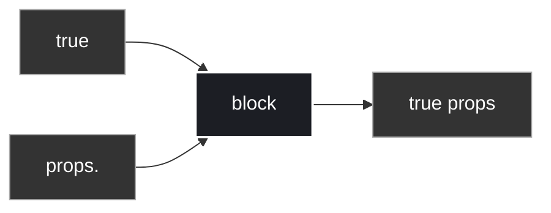
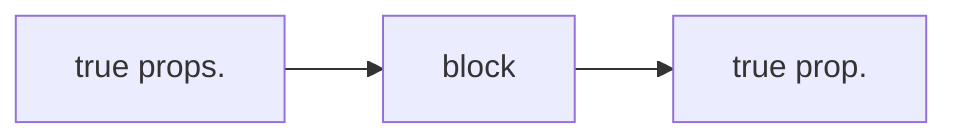
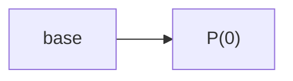
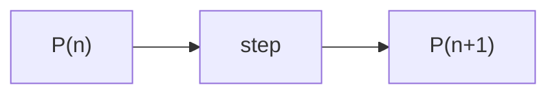
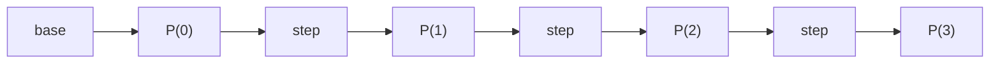

# Recap
## Mathematical Proof Techniques Cheat Sheet

| **Technique**                                | **Logical Target**                | **Core Strategy / Steps**                                                                                                                                                        |
| -------------------------------------------- | --------------------------------- | -------------------------------------------------------------------------------------------------------------------------------------------------------------------------------- |
| **Existential by Example / Construction**    | $\exists x : P(x)$                | **Construct** a specific witness element $x^*$, and then **prove** that $P(x^*)$ evaluates to true.                                                                              |
| **Universal by Instantiation**               | $\forall x : P(x)$                | Take an **arbitrary, generic** element $x$ from the domain, and **prove** $P(x)$ holds for it without assuming any special properties.                                           |
| **Universal over $\mathbb{N}$ by Induction** | $\forall n \in \mathbb{N} : P(n)$ | 1. **Base Case:** Prove $P(0)$ is true.      2. **Inductive Step:** Show that $P(n) \rightarrow P(n+1)$ holds for all $n \in \mathbb{N}$ by assuming $P(n)$ is true. |

| **Technique**                      | **Logical Target**                                 | **Operational Execution**                                                                                                                                          |
| ---------------------------------- | -------------------------------------------------- | ------------------------------------------------------------------------------------------------------------------------------------------------------------------ |
| **Implication by Direct Argument** | $P \rightarrow Q$ (not P or Q)                     | **Assume** $P$ is true, and logically deduce/derive that $Q$ must be true.                                                                                         |
| **Implication by Contrapositive**  | $P \rightarrow Q \equiv \neg Q \rightarrow \neg P$ | **Assume** $\neg Q$ (not $Q$) is true, and logically prove that $\neg P$ (not $P$) must follow.                                                                    |
| **Anything by Contradiction**      | $P$                                                | Assume the negation $\neg P$ is true, and use logical derivation to prove that this leads to a **falsehood / contradiction** ($\text{false}$ or $A \land \neg A$). |
will add proof by cases and string induction
# Proof by cases 
Proof by 2 cases
- take any proposition c
- proof `c or ~c` is tautology(always true) => proposition
- so, p is equivalent to `(c or ~c)->p`
that is `true -> p` == `~T or p` == `p`
-  `(c or ~c)->p` == `c -> p or ~c -> p`
![[Pasted image 20260630221905.png]]
this template => challenge is to pick correct C.
Thus, C is either true or false => cases are exhaustive
This is also called prove by exhaustion(we proved true for all cases)
##### example 1
![[Pasted image 20260630222253.png]], where A,B,C are preposition.
use B for prove by cases
![[Pasted image 20260630222603.png]]
![[Pasted image 20260630222913.png]]
##### example 2
Mutual friends/Strangers problem
- 6 people
- every 2 people either friend xor not friend(strangers)
Theorem : always either (3 mutual friends) or (3 mutual stranger)
example :![[Pasted image 20260630230401.png]]
proof:
proof by 2 cases
- take any person p
- there are 5 relation p is with 5 remaining people![[Pasted image 20260630230632.png]]
- case 1: p has >=3 friends
	- 3 friends are q,r,s![[Pasted image 20260630230756.png]]
	- case 1A: some 2 of g,r,s are friends
		- thus have 3 mutual friends(true) => proved theorem for this case
	- case 1B: not some 2 of q,r,s are friends
		- it is same as saying q,r,s are 3 mutual stranger => proved theorem for this case
- case 2: not p has >=3 (i.e p has at most 2 friends)
	- now p is stranger to (5-2,5) people 
	- thus, p has at least 3 strangers
	- This, is symmetric to case 1, swapping friend to stranger 1<->2
Thus, in all case theorem is true.
This is a called Ramsey Theory 
=> R(3,3)=6 where, R(F,S) function
=> R(4,4)=18
=> R(5,5)=\[43,48\] (unsolved math problems)
## Proof by k cases
have many proposition from `c1`,`c2` ... `ck`
- `c1 or c2 or c3 or ... ck`  is tautology(all cases are exhaustive and mutually exclusive)
- ![[Pasted image 20260630232236.png]]
example
4 color theorem ![[Pasted image 20260630232402.png]]
can you color any map with 4 color such that no 2 adjust place sharing a positive length have same color.
https://www.youtube.com/watch?v=s-ccr-zoNGg
Not more than 4 color are required to draw the regions of any map.
![[Pasted image 20260701222933.png]]
colors are to illustrate boundaries
![[Pasted image 20260701223130.png]]
`De morgan` proposed 4 color theorem, then was proved by `Kempe` but his prove was wrong because cases he used where not exhaustive.
in 1880,`Tate` found prove again had a bug because of same reason.
in 1976, `Appel and Haken` proved using 1834 cases solved using computer.
later found bug in that and fixed it over years.
in 1996, someone found simple proof 633 cases used computer.
in 2005, someone developed software to do such proof => `Cog language`.
in April fools ![[Pasted image 20260702230824.png]]
this map required 5 colors.
it is hard to but it is possible to 4 color that map ![[Pasted image 20260702230915.png]]

## Induction Axiom
for a predicate P(n) over n belong naturals
- if P(0) is true and P(n)->P(n+1), n belong to naturals
- then, P(n) is true over all n belong to naturals
Block diagrams for induction

can make new block induction.
## Strong induction
It is logically same(derived from) as induction.
provided P(0) is true
$$(\forall n \in \mathbb{N} : [P(0) \land P(1) \land \dots \land P(n-1)] \implies P(n)) \implies \forall n \in \mathbb{N} : P(n)$$
proof store induction is true
by induction
$$IH(n) \equiv P(0) \land P(1) \land \dots \land P(n-1) \equiv \forall i < n : P(i)$$
IH(0) is defined to be true. <-- base case
Assuming IH(n) want to prove IH(n+1).
we know IH(n) -> P(n)
thus, IH(n) and P(n) -> IH(n+1)
thus, proved by induction IH(n) is true.
as IH(n)-> P(n) thus, proved P(n) for n belongs naturals.
![[Pasted image 20260702230652.png]]
### Template for strong induction
Theorem: for all n(naturals): P(n)
Proof: 
by strong induction.
assume P(k), for every k\<n
we want to prove P(n).
can proof by cases.
- bases cases: P(0),P(1)...P(b)
- assume n>b(as proved till b manually)
- then P(n) for reasons(provided P(0) .. P(n-1))
###### example
Game of Un-stacking.