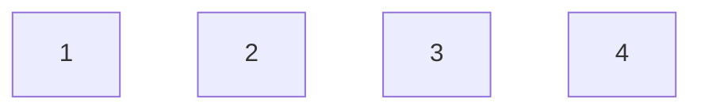
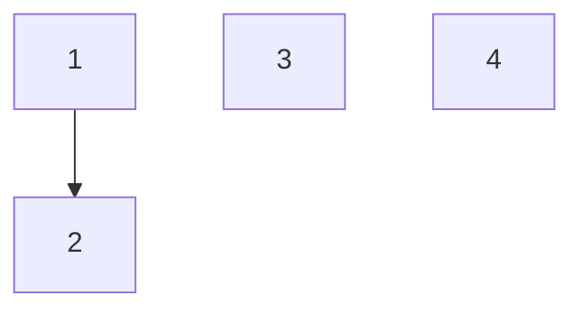
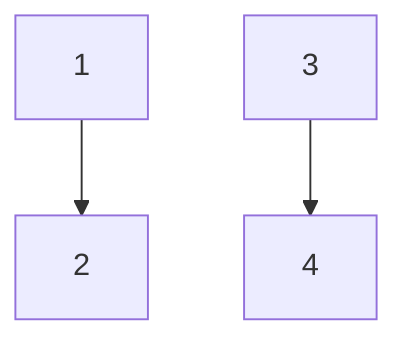
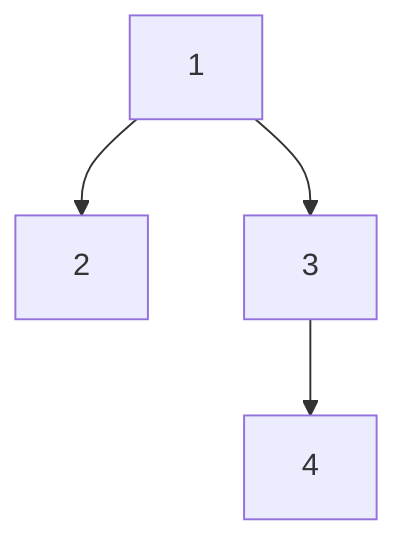
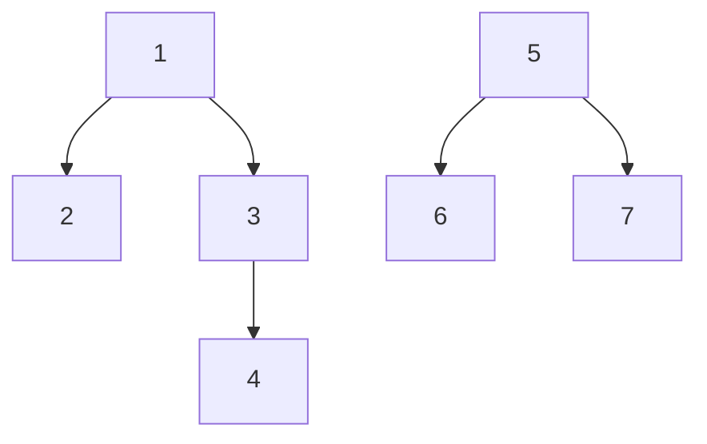
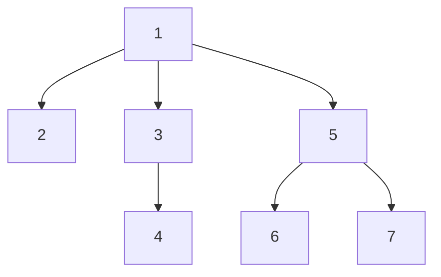
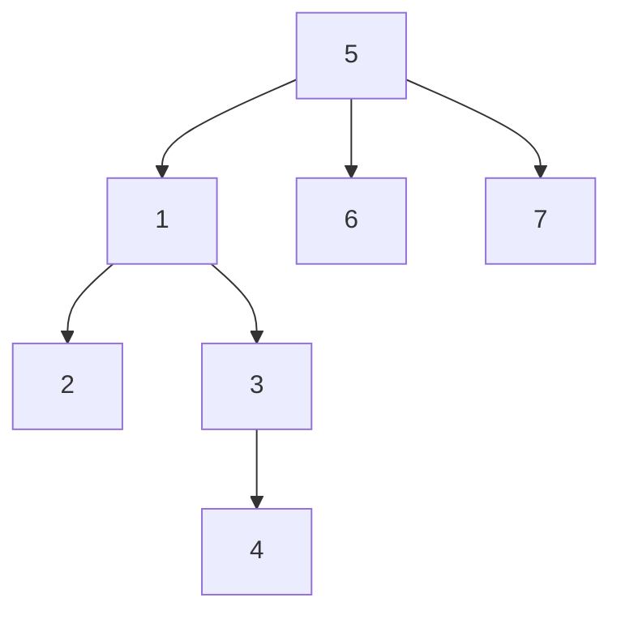

# Use
- when need to make sets of something by combining thing ==> Mostly used in group related question => it is DS
- it has 3 function
	- `make(node x)` add independent node
	- `find(node x)` give root/parent of the group
	- `union(node a,node b)` add a,b in one group(add there groups add full group)
add 1, 2, 3 -> find(1)=1, find(2)=2

`union(1,2)` find(2)=1 ,find(1)=1 ,find(3)=3

`union(3,4)` find(1)=find(2)=1, find(3)=find(4)=3

`union(2,4)` it will not join nodes 2,4 it will join there roots

now, find(1)=find(2)=find(3)=find(4)=1
```cpp
#include <bits/stdc++.h>
using namespace std;
#define ll long long

const int N=1e5+10;
int parent[N];
void make(int v){
    parent[v]=v;
}
int find(int v){
    if(v==parent[v])return v;
        // WAY 1: 
        // int a=parent[v];
        // while(a!=parent[v]){
        //     a=parent[v];
        // }
        // return a;
    return find(parent[v]);
}
void Union(int a,int b){
    // join root
    a=find(a); // root 1
    b=find(b); // root 1
    if(a!=b){ // if not in same tree
        parent[b]=a;
    }
}
```
#### Optimization 1 : This is union by size or rank
tree is not equally divided ==> may extent in a line(for some test case)
if not balanced --> find will be O(n) instead of O(logn)
Need to try to make the tree of minimum with 
- can add a->b or b->a is our choose ==> can balance it
- add small tree to big to spread it equally





- use union operation based on size(no of nodes)/rank(depth) ==> same time complexity
#### Optimization 2 : path compression
in find operation we do recursion -> make all child parent as root (avoid steps)
when traversing path to get to the root -> mark all nodes in the path root as the founded root(because there is not dis-union so no need to keep info about original parent)
calling find -> will compress the path
```cpp
#include <bits/stdc++.h>
using namespace std;
#define ll long long

const int N=1e5+10;
int parent[N];
int sz[N]; // size of tree=no of node
void make(int v){
    parent[v]=v;
    sz[v]=1; // initilized
}
int find(int v){
    if(v==parent[v])return v;
        // WAY 1: 
        // int a=parent[v];
        // while(a!=parent[v]){
        //     a=parent[v];
        // }
        // return a;
    return parent[v]=find(parent[v]); // path compression
}
void Union(int a,int b){
    // join root
    a=find(a); // root 1
    b=find(b); // root 1
    if(a!=b){ // if not in same tree
        if(sz[a]<sz[b]) swap(a,b); // union by sz
        // a is bigger than b
        parent[b]=a;
        sz[a]+=sz[b];
    }
}
```
#### Time complexity
It gives a-motorized time complexity `O(α(n))` it is called reverse-Ackerman function
It's value increase very slowly.(sometime takes longer but average is low time)
for any bigger m α(n) not cross 4 --> almost constant O(1)

find no of connected components in O(n)
```cpp
int main(){
    // give n node and k edges give no of connected components
    int n,k;
    cin>>n>>k;
    for(int i=0;i<=n;i++){
        make(i);
    }
    while(k--){
        int u,v;
        cin>>u>>v;
        Union(u,v);
    }
    int connect_ctn=0; // = no of unique parent

    int ans=0;
    for(int i=0;i<n;i++){
        if(i==find(i)) ans++;
    }
    cout<<ans<<endl;
    return 0;
}
```
