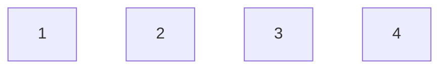
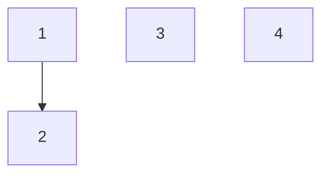
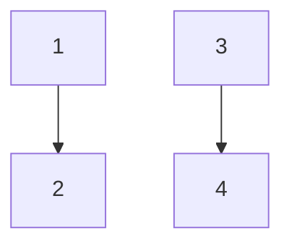
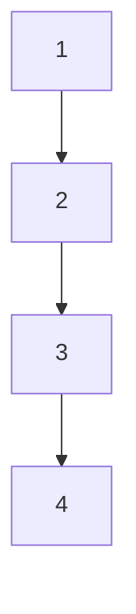

# Use
- when need to make sets of something by combining thing ==> Mostly used in group related question => it is DS
- it has 3 function
	- `make(node x)` add independent node
	- `find(node x)` give root/parent of the group
	- `union(node a,node b)` add a,b in one group(add there groups add full group)
add 1, 2, 3

`union(1,2)`

`union(3,4)`

`union(2,3)`

