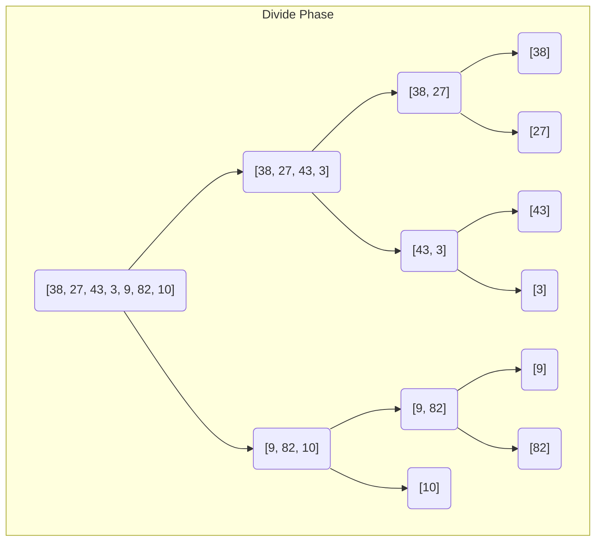
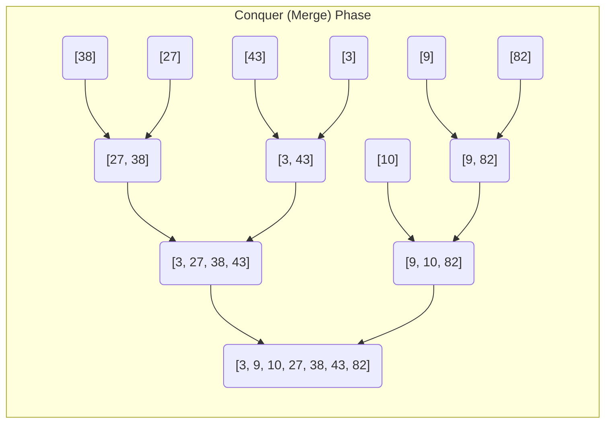

## 1. Selection Sort

Selection sort is an intuitive sorting algorithm that builds the final sorted array one item at a time by constantly hunting for the smallest element.

### The Core Logic: "Find Min & Swap"

1. Scan the unsorted portion of the array.
    
2. Find the absolute **minimum element**.
    
3. Swap it with the first element of the unsorted portion (effectively "throwing it back" to the sorted boundary).

### Dry Run Example

**Initial Array:** `[11, 25, 12, 22, 64]`

|**Unsorted Array View**|**Minimum Element Found**|**Action**|
|---|---|---|
|`[11, 25, 12, 22, 64]`|**11**|11 is already at the front.|
|`[25, 12, 22, 64]` (from index 1)|**12**|Swap 12 with 25.|
|`[25, 22, 64]` (from index 2)|**22**|Swap 22 with 25.|
|`[25, 64]` (from index 3)|**25**|25 is already in place.|
|`[64]` (from index 4)|**64**|Last element is naturally sorted.|

**Sorted Output:** `{11, 12, 22, 25, 64}`

### C++ Implementation

```cpp
#include <bits/stdc++.h>
using namespace std;

void selectionSort(int arr[], int n) {
    for (int i = 0; i < n - 1; i++) {
        int minIndex = i;
        
        // Find the minimum element in the remaining unsorted array
        for (int j = i + 1; j < n; j++) {
            if (arr[j] < arr[minIndex]) {
                minIndex = j;
            }
        }
        // Swap the found minimum element with the first unsorted element
        swap(arr[i], arr[minIndex]);
    }
}
```

## 2. Merge Sort (Divide & Conquer)

Merge Sort uses recursion to break an array down to its smallest possible pieces, and then stitches them back together in perfect order.

### The Core Premise

- **The Rule:** A single-size array is ALWAYS sorted.
    
- **The Goal:** Divide the array in halves until you reach single elements (`l == r`), then run a merging algorithm to combine them.
    
- **The Formula:** `Sorted Array 1 + Sorted Array 2 = New Sorted Array`
    
### Step 1: The Merging Algorithm

How do we combine two already sorted arrays efficiently?

- Let $a_1 = [3, 27, 38, 43]$ and $a_2 = [9, 10, 82]$
    
- Compare the front pointers: `a1[0]` vs `a2[0]`.
    
- Since $3 < 9$, push $3$ into the new array and move the $a_1$ pointer forward.
    
- **Time Complexity of Merge:** $O(n_1 + n_2) \implies \mathbf{O(n)}$
    

### Step 2: The Recursive Split & Merge Tree

Here is the exact structural tree from your notes showing how the array `[38, 27, 43, 3, 9, 82, 10]` is divided and then merged back together.






### Time Complexity Analysis

- **Splitting:** The array is repeatedly divided in half. The maximum depth of this division tree is $\log_2 n$.
    
- **Merging:** At every level of the tree, the merge operation touches all $n$ elements, taking $O(n)$ time.
    
- **Total Complexity:** $\mathbf{O(n \log n)}$
    

### C++ Implementation

```cpp
#include <bits/stdc++.h>
using namespace std;

// The Merge Step: O(n)
void merge(int arr[], int l, int mid, int r) {
    int n1 = mid - l + 1;
    int n2 = r - mid;
    
    // Create temporary arrays
    vector<int> a1(n1), a2(n2);
    for (int i = 0; i < n1; i++) a1[i] = arr[l + i];
    for (int i = 0; i < n2; i++) a2[i] = arr[mid + 1 + i];
    
    int i = 0, j = 0, k = l;
    
    // Compare pointers and place the minimum into the original array
    while (i < n1 && j < n2) {
        if (a1[i] <= a2[j]) arr[k++] = a1[i++];
        else arr[k++] = a2[j++];
    }
    
    // Catch any remaining elements
    while (i < n1) arr[k++] = a1[i++];
    while (j < n2) arr[k++] = a2[j++];
}

// The Recursive Split: O(log n)
void mergeSort(int arr[], int l, int r) {
    // Base Condition: If the array is a single element, it's already sorted!
    if (l >= r) return; 
    
    int mid = l + (r - l) / 2;
    
    // Divide array in halfs
    mergeSort(arr, l, mid);
    mergeSort(arr, mid + 1, r);
    
    // Merge them together
    merge(arr, l, mid, r);
}

int main() {
    int arr[] = {38, 27, 43, 3, 9, 82, 10};
    int n = sizeof(arr) / sizeof(arr[0]);
    
    mergeSort(arr, 0, n - 1);
    
    for(int i = 0; i < n; i++) cout << arr[i] << " ";
    // Output: 3 9 10 27 38 43 82
    return 0;
}
```
