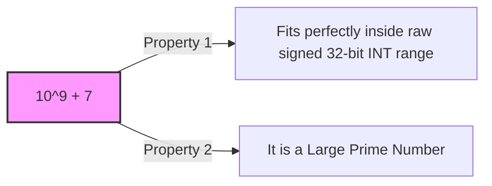

## 1. Core Mathematical Properties
When answers grow too large to store in standard data types, we distribute the modulo operator $\%$ across intermediate calculations.
- **Addition Property:**
    $$(a + b) \% M = ((a \% M) + (b \% M)) \% M$$
    
- **Multiplication Property:**
    $$(a \times b) \% M = ((a \% M) \times (b \% M)) \% M$$
    
- **Subtraction Property:**
    $$(a - b) \% M = ((a \% M) - (b \% M) + M) \% M$$
> [!note]
> The term $(a \% M) - (b \% M)$ can yield a **negative result**. Adding $M$ shifts the value back into positive territory before executing the final modulo operations.
- **Division Property (Modular Inverse):**
    
    $$(a / b) \% M = ((a \% M) \times (b^{-1} \% M)) \% M$$
    
    _(Where $b^{-1}$ represents the Modular Multiplicative Inverse of $b$ under modulo $M$.)_

> [!important]
> Unlike standard algebra where you can easily compute log​(y) using a calculator, **modular logs have no clean mathematical shortcuts**. The values bounce around randomly across the modulo space.
-To crack it, an attacker has to resort to brute-force trial and error. For modern cryptographic key sizes (e.g., 2048-bit primes), it would take classical supercomputers **billions of years** to compute that single hidden exponent x. This asymmetry is what creates the uncrackable "padlock" protecting internet traffic.
## 2. Why Use Modular Arithmetic? (The CP Trap)

Consider a problem where you need to print the factorial of $N$ ($N!$) for $0 \le N \le 100$.

- **The Problem:** $100! \approx 9.3 \times 10^{157}$. Standard unsigned data types cannot register these sizes. Even small factorials like $21!$ will completely **overflow** regular scalar registers, reverting your code into garbage negative numbers.
    
- **The Strategy:** Platforms ask for the result **Modulo $M$** (e.g., $M = 47$). Because any value $X \% 47 < 47$, the result fits safely inside a basic integer variable.
    
- **The Execution Rule:** You must distribute the modulo check to **each intermediate calculation step** rather than applying it at the very end.
### Step-by-Step Breakdown ($5! \% 47$)

Instead of evaluating $120 \% 47$:

$$5! \% 47 = (1 \times 2 \times 3 \times 4 \times 5) \% 47$$

$$\implies \left( (1 \times 2 \times 3 \times 4) \% 47 \times (5 \% 47) \right) \% 47$$

### Code Implementation Pattern

```cpp
#include <bits/stdc++.h>
using namespace std;

int main() {
    int n = 5;
    long long M = 47;
    long long fact = 1;
    
    for (int i = 1; i <= n; i++) {
        // Compute intermediate steps continuously under Modulo M
        fact = (fact * i) % M; 
    }
    
    cout << fact; // Output: 26 (Since 120 % 47 = 26)
    return 0;
}
```

## 3. The Significance of $M = 10^9 + 7$

You will see the constraint `"Print the answer modulo 10^9 + 7"` in almost every competitive programming question.


### 1. Integer Capacity Boundaries

The maximum capacity constraint of a signed 32-bit `int` is $\approx 2.14 \times 10^9$.

- Choosing $10^9 + 7$ ensures that you can safely add(as may double and overflow) two modulo-ed integers together without triggering an overflow:
    $$(10^9 + 6) + (10^9 + 6) \approx 2 \times 10^9 \quad (\text{Safe within INT\_MAX})$$
    

### 2. Multiplicative Inverse Optimization

Finding the modular inverse ($b^{-1} \% M$) requires $M$ to co-prime with $b$. By selecting a large prime number like $10^9 + 7$, **every integer from $1$ to $n$ ($n < 10^9+7$) is guaranteed to have a valid modular multiplicative inverse**. This property allows you to execute division operations under a modulo comfortably using Fermat's Little Theorem.
