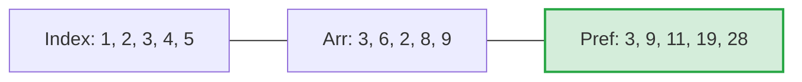

There is the evolution from basic $O(N)$ brute-force calculations into $O(1)$ constant-time lookup.

> [!important]
> Precompute knowledge so each query is a lookup, not a journey.

# Pre-Computation & Hashing Techniques

## 1. The Philosophy of Pre-Computation

Instead of recalculating values for every single query in a test case, we compute all possible required values once upfront, store them in a structural memory map (like an array), and answer subsequent queries in **$O(1)$ time**.
## 2. Hashing (Frequency Counting)

Hashing in basic CP typically means using the element's actual value as an array index to store its frequency count.
### The Global Array Size Compilation Error Trap

When declaring massive global hash arrays to store counts, the size parameter **must be a constant evaluated at compile-time**, otherwise the compiler will throw an error.

```cpp
#include <bits/stdc++.h>
using namespace std;

// ❌ WRONG: 'S' is a mutable variable, compiler rejects it for global array size.
int S = 1e7 + 10;
int hsh_error[S]; 

// ✅ CORRECT: 'const' locks the variable at compile-time.
const int S = 1e7 + 10;
int hsh_correct[S]; // Auto-initialized to 0 because it's global!

int main() {
    return 0;
}
```
### Hashing Negative Numbers (Offset Shifting)

You cannot use a negative number as an array index (e.g., `hash[-4]` causes a Segmentation Fault).

**Solution:** Find the _most negative_ element in your range, and shift the entire array upwards by that absolute value.

- **Original Array:** `[-4, 2, 1, -6]` (Most negative is `-6`)
    
- **Shift Operation:** Add `+6` to every element.
    
- **New Array:** `[2, 8, 7, 0]`
    
- Now you can safely hash it! To check the count of `-4`, you query `hash[-4 + 6]`, which is `hash[2]`.
## 3. Prefix Sum Arrays (1D & 2D)

### 1D Prefix Sums

Used to instantly answer range sum queries $[L, R]$.

> [!important] 1-Based Indexing Rule
> 
> ALWAYS use 1-based indexing when building Prefix Sum arrays. If you use 0-based indexing, querying $L=0$ requires you to access `prefix[L-1]`, which evaluates to `prefix[-1]` and crashes your program.

**Formula:**

$$\text{prefix}[i] = \text{prefix}[i-1] + \text{arr}[i]$$

**Query Sum $[L, R]$:**

$$\text{Sum}(L, R) = \text{prefix}[R] - \text{prefix}[L-1]$$



_(Example: Sum of indices 2 to 4 $\implies \text{pref}[4] - \text{pref}[1] \implies 19 - 3 = 16$)_

### 2D Prefix Sums (Grid Math)

To find the sum of elements inside a 2D sub-grid, we pre-compute a 2D prefix array where `prefix[i][j]` stores the sum of all elements from `(1,1)` up to `(i,j)`

**Building the 2D Prefix Array:**

Include the cell above, include the cell to the left, subtract the overlapping diagonal cell, and add the current matrix value.

$$\text{pref}[a][b] = \text{pref}[a-1][b] + \text{pref}[a][b-1] - \text{pref}[a-1][b-1] + \text{arr}[a][b]$$

> [!note]
> The entire logic of 2D prefix arrays relies on a mathematical concept called the **Inclusion-Exclusion Principle**. Because we are computing rectangular areas on a grid, simply adding or subtracting adjacent regions will always cause overlapping boundary zones to be counted (or removed) **twice**.

**Querying a Sub-grid from top-left $(a,b)$ to bottom-right $(c,d)$:**

$$\text{Sum} = \text{pref}[c][d] - \text{pref}[a-1][d] - \text{pref}[c][b-1] + \text{pref}[a-1][b-1]$$

## 4. Difference Array (Prefix Sum + Range Additions)

_Also known as "Line Sweep" or "Range Update" technique._

**Problem:** You are given an array of zeros. You receive $Q$ queries telling you to add value $X$ to all elements from index $L$ to $R$. Doing this via brute force takes $O(N \times Q)$, which gives TLE.

**The $O(1)$ Optimization:**

1. Add $X$ to the starting boundary: `arr[L] += X`
    
2. Subtract $X$ just outside the ending boundary: `arr[R+1] -= X`
    
3. After processing all $Q$ queries, run a standard Prefix Sum across the array. The $+X$ will "flow" forward, and the $-X$ will act as a dam, stopping it exactly where it should end.

```cpp
#include <bits/stdc++.h>
using namespace std;

const int N = 1e5 + 10;
int arr[N];

int main() {
    int q; cin >> q;
    while(q--) {
        int l, r, x;
        cin >> l >> r >> x;
        
        // O(1) Range Addition
        arr[l] += x;
        arr[r + 1] -= x;
    }
    
    // O(N) Post-Computation (Flowing the values)
    for(int i = 1; i < N; i++) {
        arr[i] = arr[i] + arr[i-1]; 
    }
    return 0;
}
```

## 5. Prefix GCD Properties

Prefix logic isn't just for sums; it works perfectly for Greatest Common Divisor (GCD) because the GCD operation is **Associative**.

$$\text{gcd}(a,b,c) = \text{gcd}(\text{gcd}(a,b), c)$$

- **Identity Rule:** $\text{gcd}(0, a) = a$
    
- **Monotonicity Rule:** GCD only ever decreases or stays the same as you add more elements to the range. $\text{gcd}(a) \ge \text{gcd}(a,b) \ge \text{gcd}(a,b,c)$
###### The Core Intuition: "The Divisor Filter"
Think of the GCD as a strict filter. The GCD is the largest number that can perfectly divide _everything_ in your current group. When you introduce a brand new number to the group, one of two things happens:

1. **It agrees with the current filter:** The new number is a multiple of your current GCD. The filter doesn't need to change. (The GCD **stays the same**).
    
2. **It restricts the filter further:** The new number does _not_ share all the factors of your current GCD. To find a number that divides everything, the GCD must strip away some of its factors to accommodate the new guy. (The GCD **decreases**).
    

Because you are only ever adding constraints (more numbers that must be divided), the GCD can **never grow**.
## 6. The Master Concept: Hashing + Prefix Sums (Palindrome Queries)

**The Problem:** Given a massive string and $Q$ queries $(L, R)$, check if the sub-string from $L$ to $R$ can be rearranged to form a palindrome.

- **Brute Force ($O(Q \times N)$):** Loop $L$ to $R$ for every query, count character frequencies. **Result: TLE.**

### The Mathematical Condition for a Palindrome:

- **Even Length (2n):** Every character must appear an even number of times.
    
- **Odd Length (2n+1):** Exactly ONE character can appear an odd number of times.
    
- **Universal Rule:** _Count the frequencies of all characters in the range. If more than 1 character has an odd frequency, it CANNOT form a palindrome._
    
### The Optimization: 2D Frequency Prefix Array

Instead of counting characters during the query, we pre-compute a 2D Prefix Sum array of size `[26][N+1]`. Think of it as 26 separate 1D prefix sum arrays, one for tracking the letter 'a', one for 'b', etc.

**Time Complexity:** * Pre-computation: $O(26 \times N)$

- Query: $O(26) \approx O(1)$

```cpp
#include <bits/stdc++.h>
using namespace std;

const int N = 1e5 + 10;
int pref[26][N]; // 26 rows for a-z, N columns for string length

int main() {
    string s;
    cin >> s;
    int n = s.size();
    
    // 1-Based Pre-computation
    for(int i = 0; i < n; i++) {
        int char_idx = s[i] - 'a'; // Convert 'a'-'z' to 0-25
        
        // Carry forward the previous prefix counts for all 26 letters
        for(int j = 0; j < 26; j++) {
            pref[j][i + 1] = pref[j][i];
        }
        
        // Increment the count for the current character at this position
        pref[char_idx][i + 1]++;
    }
    
    int q; cin >> q;
    while(q--) {
        int l, r; 
        cin >> l >> r; // Assuming 1-based queries
        
        int odd_count = 0;
        
        // Check frequencies of all 26 characters in range [L, R]
        for(int i = 0; i < 26; i++) {
            int char_freq = pref[i][r] - pref[i][l - 1];
            if(char_freq % 2 != 0) {
                odd_count++;
            }
        }
        
        // At most 1 odd frequency is allowed for a valid palindrome
        if(odd_count > 1) cout << "NO\n";
        else cout << "YES\n";
    }
    return 0;
}
```
