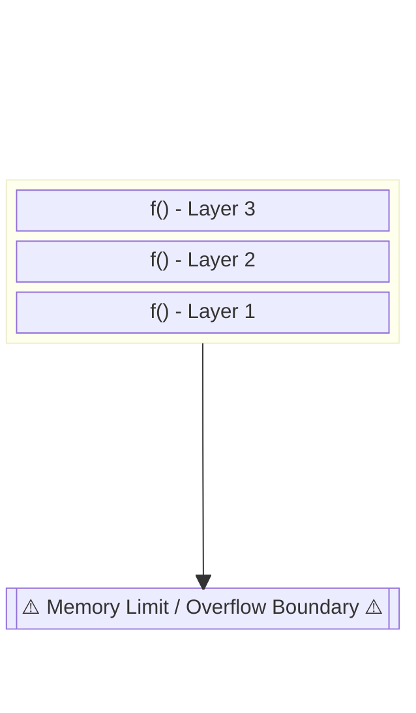
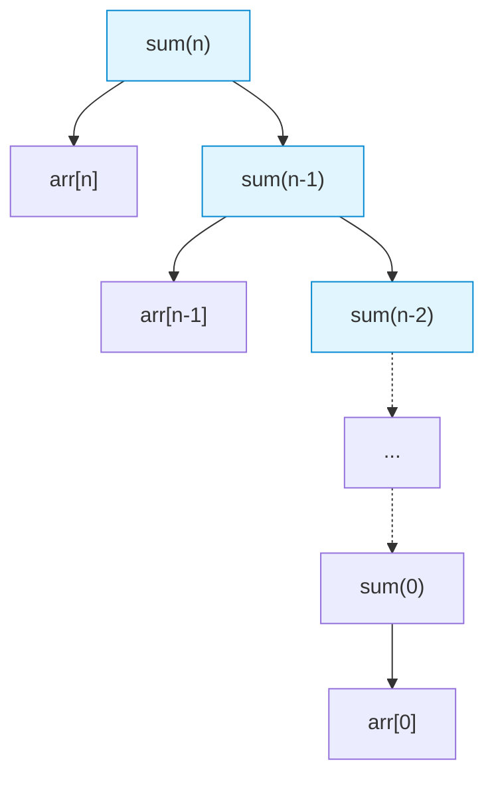

## 1. What is Recursion?

At its core, recursion is a **function calling itself** to solve smaller instances of the same problem. It mirrors mathematical recurrence relations.

For example, think of piece-wise or recursive mathematical definitions:

- **Absolute Value:** $abs(x) = \begin{cases} -x, & x < 0 \\ x, & x \ge 0 \end{cases}$
    
- **Factorial:** $fac(n) = 1 \times 2 \times \dots \times (n-1) \times n$
    
    - _Recursive Definition:_ $fac(n) = fac(n-1) \times n$
        

## 2. The Call Stack & Base Conditions

Every time a function calls itself, it pauses its current execution and places a new "frame" on top of the computer's memory **Stack**.

> [!danger] The Stack Overflow (Memory Error) If a function keeps calling itself endlessly without a stopping rule, it will hit the memory ceiling limit of the stack. This triggers a **Segmentation Fault** (Memory Error / Stack Overflow) and crashes the program.


### The Fix: Base Condition

To prevent stack overflow, every recursive function must have a **Base Condition**—a strict rule that tells the function to stop calling itself and start returning answers back down the stack.

- _Example for Factorial:_ `f(0) = 1` or `f(1) = 1`.
## 3. Calculating Time Complexity in Recursion

The golden rule for finding the time complexity of a recursive algorithm:

$$\text{Time Complexity} = (\text{Total Number of Function Calls}) \times (\text{Time taken per call})$$

- **Factorial Example:** To calculate $n!$, the function makes $n$ separate calls. Inside each call, it just does one multiplication step $O(1)$.
    
    - $\text{Complexity} = n \times O(1) \implies \mathbf{O(n)}$
## 4. Problem Pattern 1: Sum of an Array

**Question:** Find the sum of an array using recursion up to index $n$. **Definition:** $\text{Sum}(n) = \text{arr}[n] + \text{Sum}(n-1)$

### The Recursion Tree

When visualized, the recursive calls split into the current value and the deferred call to the next lower index:



- **Time Complexity:** The tree goes $n$ levels deep, making $n$ calls. $\implies \mathbf{O(n)}$.


```cpp
#include <bits/stdc++.h>
using namespace std;

int arraySum(int arr[], int n) {
    // Base Condition: If index reaches 0, return the 0th element
    if(n == 0) return arr[0];
    
    // Recursive Step
    return arr[n] + arraySum(arr, n - 1);
}

int main() {
    int arr[] = {10, 20, 30, 40};
    cout << arraySum(arr, 3); // Passing highest index (3). Output: 100
    return 0;
}
```

## 5. Problem Pattern 2: Sum of Digits

**Question:** Given a massive number (e.g., $n = 12345$), find the sum of its digits recursively. **Logic:** Extract the last digit using `% 10`, then pass the remaining digits using `/ 10` to the next recursive step. **Definition:** $S(n) = (n \% 10) + S(n / 10)$

### Time Complexity Analysis

How many times will this run? It will run for the exact **number of digits** inside $n$.

- To find the number of digits mathematically, we use base-10 logarithms: $\approx \log_{10}(n)$.
    
- For example, $\log_{10}(100) = 2$ (3 digits, roughly scaling to log value).
    
- **Time Complexity:** $\mathbf{O(\log_{10} n)}$ (Often just written as $O(\log n)$).
    
```cpp
#include <bits/stdc++.h>
using namespace std;

int digitSum(int n) {
    // Base Condition: If the number becomes 0, there are no digits left
    if(n == 0) return 0;
    
    // Recursive Step: Last digit + Sum of the rest
    return (n % 10) + digitSum(n / 10);
}

int main() {
    int n = 12345;
    cout << digitSum(n); // Output: 15
    return 0;
}
```

> [!tip] CP Training Hack To strengthen your recursive thinking, **try writing standard loop problems using recursion instead.** Any problem that can be solved with a `for` or `while` loop (like digit sums, array printing, or string reversals) can be rewritten as a recursive function.
