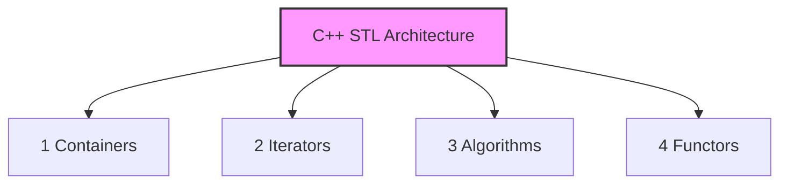

# C++ Standard Template Library (STL) Introduction

The **Standard Template Library (STL)** is a powerful collection of pre-implemented templates providing complex data structures and high-performance algorithms natively inside C++.

## 1. The Four Pillars of STL

The STL library framework is structurally divided into four distinct components:

- **Containers:** Pre-implemented collections used to store and manage data structures.
    
- **Iterators:** Specialized tracking pointers that bridge algorithms to data containers by navigating memory addresses.
    
- **Algorithms:** Highly optimized standard functions (e.g., sorting, binary searching) used to manipulate data elements.
    
- **Functors:** Custom classes or structures containing overloaded call operators that act like traditional functions.



## 2. Container Classification Map

Containers are grouped based on how elements are arranged, linked, and retrieved from physical memory spaces:

| **Sequential / Linear**                                           | **Unordered Associative**                                                | **Ordered Associative**                                                                      |
| ----------------------------------------------------------------- | ------------------------------------------------------------------------ | -------------------------------------------------------------------------------------------- |
| Elements sit sequentially in continuous or linked storage blocks. | Elements are arranged via hash tables for rapid $O(1)$ expected lookups. | Elements are organized in balanced trees, auto-sorting items internally.                     |
| • `vector`<br><br>  <br><br>• `stack`<br><br>  <br><br>• `queue`  | • `unordered_map`<br><br>  <br><br>• `unordered_set`                     | • `map`<br><br>  <br><br>• `multimap`<br><br>  <br><br>• `set`<br><br>  <br><br>• `multiset` |

### Nested Container Architectures

For advanced multi-dimensional DSA mapping (e.g., Graphs, Grids, Grouped Frequency counts), you can deeply nest STL containers inside one another:

- `vector<vector<int>>` $\rightarrow$ A dynamic 2D grid matrix.
    
- `map<int, vector<int>>` $\rightarrow$ Map keys bound to a list array (common for Graph Adjacency Lists).
    
- `set<pair<int, string>>` $\rightarrow$ A sorted set of paired structural tracking coordinates.
    
- `vector<map<int, set<int>>>` $\rightarrow$ A deep three-tier nested structural storage system.
## 3. Iterators (Memory Navigators)

Iterators act as specialized pointer objects pointing directly to the specific **memory addresses** of elements held within a container collection. They provide a standardized way to traverse elements linearly across continuous or non-contiguous data structures.

### Core Tracking Methods

- `begin()` $\rightarrow$ Returns an iterator pointing to the **very first element** in the collection container.
    
- `end()` $\rightarrow$ Returns an iterator pointing to the theoretical memory space **just after the final element** of the container.
### Declaration Syntax

```cpp
#include <bits/stdc++.h>
using namespace std;

int main() {
    vector<int> v = {10, 20, 30};
    
    // Explicitly defining an iterator pointing to the start address
    vector<int>::iterator it = v.begin(); 
    
    cout << *it; // Dereferencing prints the value at that address: 10
    return 0;
}
```

## 4. Algorithms & Functors Cheat Sheet

### Essential Algorithms (`<algorithm>`)

- `lower_bound()` / `upper_bound()` $\rightarrow$ Highly optimized searching filters built on top of **Binary Search** logic ($O(\log n)$).
    
- `sort(arr, arr+n, comparator)` $\rightarrow$ Fast introspective sorting optimization running in $O(n \log n)$ time limits.
    
- `max_element()` / `min_element()` $\rightarrow$ Locates extreme boundary items inside memory ranges.
    
- `accumulate()` $\rightarrow$ Rapidly tallies the total linear mathematical sum of a range.
    
- `reverse()` $\rightarrow$ Inverts the exact physical ordering layout of range elements.
    
- `count()` / `find()` $\rightarrow$ Counts or checks structural locations of elements.
    
- `next_permutation()` / `prev_permutation()` $\rightarrow$ Computes sequential lexicographical rearrangements.

### Functors Overview

A functor is a class or structure object that behaves like a function. This behavior is achieved by explicitly overloading the function call parenthesis operator `operator()`. They are commonly injected into standard algorithms to implement custom sorting or filtration criteria.

## 5. The Pair Utility Class (`std::pair`)

> [!note] Structural Clarification
> 
> A `pair` is **not a standalone container**. It is a utility wrapper **class structure** included inside the `<utility>` library (implicitly pulled via `<bits/stdc++.h>`) that allows us to bind two distinct values together into a single unified object variable.

### Core Purpose

- Used extensively to maintain relative relationship tracking between two data fields (e.g., coordinate pairs `(x, y)`, weight-vertex edges in graphs, or item-price mappings).

### Initialization Options & Element Access

To read or write properties to your pair object structure, query its two internal pointer reference members: `.first` and `.second`.

```cpp
#include <bits/stdc++.h>
using namespace std;

int main() {
    // 1. Standard Declaration & Initialization via make_pair()
    pair<int, int> p1;
    p1 = make_pair(11, 26);
    
    cout << p1.first << " " << p1.second << endl; // Output: 11 26
    
    // 2. Modern Literal Initializer Syntax (Highly Recommended for CP)
    pair<int, int> p2 = {36, 2};
    cout << p2.first << " " << p2.second << endl; // Output: 36 2
    
    // Pairs can be passed around and assigned cleanly by value or reference
    pair<int, int> p3 = p2; 
    return 0;
}
```