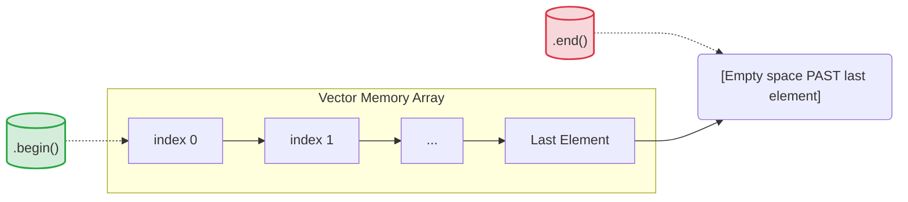

# C++ STL: Vectors & Iterators

## 1. Vector Fundamentals

A `vector` is a dynamic array that automatically resizes itself when elements are inserted or deleted. Importantly, just like standard arrays, a vector places its elements in **continuous memory blocks**.

### Basic Operations & Time Complexity

- **Declaration:** `vector<datatype> v;` (Uses 0-based indexing)
    
- `v.push_back(val)`: Appends a value to the extreme back of the vector. $\implies \mathbf{O(1)}$
    
- `v.pop_back()`: Removes the very last element from the vector. $\implies \mathbf{O(1)}$
    
- `v.size()`: Returns the current dynamic size (element count) of the vector. $\implies \mathbf{O(1)}$

### Continuous Memory Limits (The Size Cap)

Because vectors require a single, unbroken block of memory to remain contiguous, they are strictly bound by the same size constraints as standard arrays.

- **Local Scope (Inside `main`):** Maximum $\approx 10^5$ elements.
    
- **Global Scope (Outside `main`):** Maximum $\approx 10^7$ elements.
    

## 2. Initialization Patterns

You can pre-allocate sizes and default values for vectors right at declaration.

```cpp
#include <bits/stdc++.h>
using namespace std;

int main() {
    // 1. Pre-size with default values (0 for integers)
    vector<int> v1(10); // Creates: [0, 0, 0, 0, 0, 0, 0, 0, 0, 0]
    
    // 2. The Dynamic Rule: Pushing to a pre-sized vector adds to the END
    v1.push_back(1); // Becomes size 11: [0, 0, 0, 0, 0, 0, 0, 0, 0, 0, 1]
    
    // 3. Pre-size AND Pre-fill
    vector<int> v2(3, 3); // Creates size 3, filled with 3: [3, 3, 3]
    
    return 0;
}
```

## 3. The $O(N)$ Copy Trap & Passing by Reference

> [!danger] The Vector Copy Penalty
> 
> Unlike standard arrays, C++ allows you to directly assign one vector to another (`vector<int> v2 = v1;`). However, this is an incredibly expensive operation! It internally loops through every single element to create a fresh copy, taking **$\mathbf{O(N)}$ time**.

To avoid Time Limit Exceeded (TLE) errors, **always pass vectors to functions by reference (`&`)**.

```cpp
#include <bits/stdc++.h>
using namespace std;

// ✅ CORRECT: Passes the memory address. O(1) time complexity.
void printVectorFast(vector<int> &v) {
    // Process vector
}

// ❌ WRONG: Creates a full O(N) duplicate of the vector every time it's called!
void printVectorSlow(vector<int> v) { 
    // Process vector
}

int main() {
    vector<int> v1 = {1, 2, 3};
    
    // O(N) Deep Copy
    vector<int> v_copy = v1; 
    
    // O(1) Reference Binding (No copy made, modifies v1 directly)
    vector<int> &v_ref = v1; 
}
```
## 4. Advanced Nested Structures

Vectors can hold absolutely any datatype, including pairs or other containers.
### Vector of Pairs

Incredibly common for graph algorithms and interval problems.

- **Syntax:** `vector<pair<int, int>> v;`
    
- Each element accessed via `v[i].first` and `v[i].second`.
### 2D Matrix Architectures

|**Structure**|**Syntax**|**Behavior**|
|---|---|---|
|**Array of Vectors**|`vector<int> a[10];`|The number of rows is **Fixed (10)**, but the columns (vector elements) are dynamic.|
|**Vector of Vectors**|`vector<vector<int>> a;`|Completely dynamic 2D grid. Both rows and columns can grow or shrink.|

## 5. Iterators (Deep Dive)

Not all data structures have standard indices (`0` to `n-1`). Iterators are pointer-like objects used to point at the memory addresses of elements inside _any_ container.


- `v.begin()`: Points directly at the 1st element.
    
- `v.end()`: Points to the empty memory gap directly _after_ the last element.
    
- **Declaration:** `vector<int>::iterator it = v.begin();`
    
- **Dereferencing:** Use `*it` to extract the value the iterator is currently pointing at.
    

## 6. The `it++` vs `it + 1` Memory Trap

This is a critical distinction when moving iterators.

- `it + 1` calculates the **next sequential physical memory block** (Pointer Arithmetic).
    
- `it++` uses the container's internal logic to move to the **next structural element**.

### Why it matters:

1. **Continuous Memory (Vectors / Arrays):** Both `it++` and `it + 1` work identically because the next element is guaranteed to be in the adjacent memory block.
    
2. **Non-Continuous Memory (Maps / Sets):** Elements are scattered around RAM and linked via node pointers (like a tree). Doing `it + 1` throws a **compilation error** (or undefined garbage behavior) because the next physical block of RAM means nothing. You **must use `it++`** to structurally traverse to the next node.

### Pair Iterator Syntax Shortcut

If an iterator is pointing to a pair, you can access the `.first` and `.second` values smoothly using the arrow operator:

$$(\text{*it})\text{.first} \iff \text{it}\rightarrow\text{first}$$

## 7. C++11 Modern Syntax Shortcuts

Writing out `vector<int>::iterator it;` is exhausting. C++11 introduced syntactic sugar to make competitive programming significantly faster.

### 1. The `auto` Keyword

`auto` forces the compiler to automatically deduce the datatype at compile-time.

```cpp
// Old Way:
vector<pair<int, int>>::iterator it = v.begin();

// New Way:
auto it = v.begin(); 
```

### 2. Range-Based `for` Loops

Loop directly over elements without managing indices or iterators.

```cpp
#include <bits/stdc++.h>
using namespace std;

int main() {
// IMP POINT 
    vector<int> v = {10, 20, 30};
    
    // 1. Pass by Value (Creates a copy of each element, modifying 'val' does nothing to 'v')
    for (int val : v) {
        cout << val << " "; 
    }
    
    // 2. Pass by Reference (Accesses exact memory, modifies 'v' directly)
    for (int &val : v) {
        val *= 2; 
    }
    
    // 3. Ultimate CP Shortcut (Auto + Reference)
    for (auto &val : v) {
        cout << val << " "; 
    }
    
    return 0;
}
```
