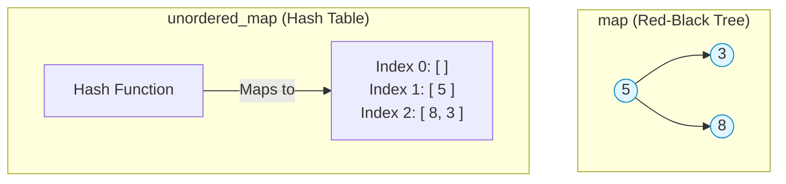

## 1. Map Architecture Overview

A Map is an associative container that stores elements in **(Key, Value) pairs**. Every key acts as a unique identifier mapping to a specific value.

There are 3 primary types of maps in C++:

1. `map` (Ordered / Sorted)
    
2. `unordered_map` (Unsorted / Hashed)
    
3. `multimap` (Sorted, but allows duplicate keys)

## 2. Standard `map` (Ordered)

A standard `map` internally implements a **Red-Black Tree** (a self-balancing Binary Search Tree). Because of this tree structure, **every key is strictly unique and automatically sorted** in lexicographical/ascending order.
### Basic Operations & The Default Value Trap

- **Declaration:** `map<int, string> m;`
    
- **Insertion:** `m[1] = "abc";` or `m.insert({1, "abc"});`
    
- **Size:** `m.size();` returns the total number of key-value pairs.
    
- **Clear:** `m.clear();` completely empties the map.

> [!warning] The Implicit Insertion Trap
> 
> In C++, simply accessing a key that doesn't exist yet (e.g., writing `m[5];`) will **automatically insert that key into the map** and assign it a default value (`0` for integers, `""` empty string for strings, etc.). This operation alone costs $O(\log n)$ time and increases your map size!
### Finding Elements & Iterator Mechanics

The `.find(key)` method searches for a key and returns an **iterator** pointing to that specific `(Key, Value)` pair.

```cpp
#include <bits/stdc++.h>
using namespace std;

int main() {
    map<int, string> m;
    m[1] = "abc";
    m[5] = "cde";
    
    auto it = m.find(5); // Returns iterator pointing to {5, "cde"}
    
    // Check if key exists
    if(it != m.end()) {
        cout << (*it).first << " -> " << (*it).second << endl; // Output: 5 -> cde
    } else {
        cout << "Key not found!" << endl;
    }
    return 0;
}
```

> [!danger] Segmentation Fault (`m.end()`)
> 
> If `.find()` cannot locate the key, it returns `m.end()`. `m.end()` points to the empty memory void _after_ the last element. If you attempt to dereference it (e.g., `(*m.end()).first`), your program will instantly crash with a **Segmentation Fault**.

### Erasing Elements

- `m.erase(key)`: Deletes the pair directly by its key.
    
- `m.erase(iterator)`: Deletes the pair at that exact memory location. _(Never pass `m.end()` to `.erase()`!)_
    

## 3. Time Complexity & The String Key Multiplier

Because standard maps use Trees, operations rely on comparing keys to traverse left or right down the branches.

- **Insertion:** $O(\log n)$
    
- **Access / Find:** $O(\log n)$
    
- **Looping over entire map:** $O(n \log n)$

### The String Comparison Hidden Cost

When your key is an integer, comparing `a > b` is instantaneous ($O(1)$). But if your key is a `string`, the map must compare characters lexicographically to figure out where to place it in the tree.

If your string key has a length of $S$, the true time complexity of inserting or finding `m["string"]` becomes:

$$\mathbf{O(S.\text{size}() \times \log n)}$$

## 4. `map` vs `unordered_map`

This is one of the most critical structural differences in C++.

| **Feature**              | **map (Ordered)**                                                                                     | **unordered_map**                                                                                   |
| ------------------------ | ----------------------------------------------------------------------------------------------------- | --------------------------------------------------------------------------------------------------- |
| **Internal Structure**   | Red-Black Tree                                                                                        | Hash Table                                                                                          |
| **Element Order**        | Sorted (Lexicographical / Ascending)                                                                  | Random / Unordered                                                                                  |
| **Time Complexity**      | $O(\log n)$                                                                                           | **$O(1)$ Average** (Worst case $O(n)$ if hash collisions occur)                                     |
| **Valid Key Data Types** | Keys can be **Anything** (including `pair`, `vector`, `set`) as long as they are _comparable_ via `<` | Keys **Must be Hashable**. You _cannot_ use complex types like `pair` or `vector` as keys natively! |



## 5. Multimaps

A `multimap` operates exactly like a standard ordered `map` (it uses trees, sorts keys, and runs in $O(\log n)$ time), with one singular difference: **It allows duplicate keys.**

```cpp
#include <bits/stdc++.h>
using namespace std;

int main() {
    multimap<int, string> mm;
    
    // You can insert the same key multiple times!
    mm.insert({1, "apple"});
    mm.insert({1, "banana"});
    mm.insert({2, "cherry"});
    
    return 0;
}
```

_(Note: You cannot use the `mm[key] = value` syntax in multimaps because the compiler wouldn't know which duplicate key you are trying to update. You must use `.insert()`)_
