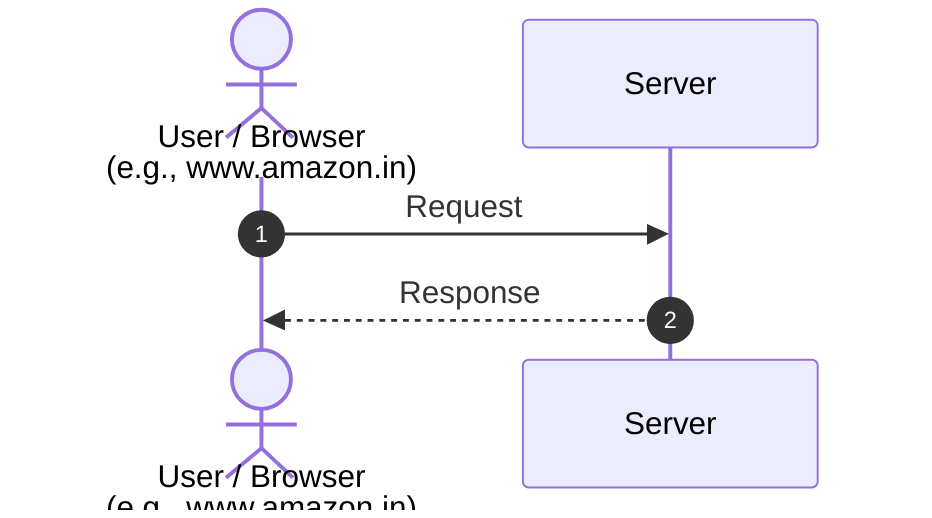
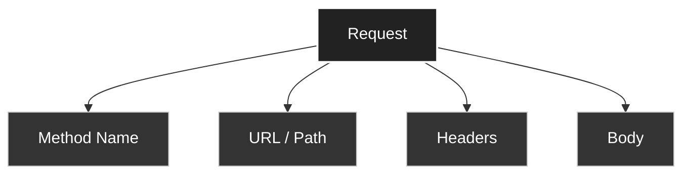
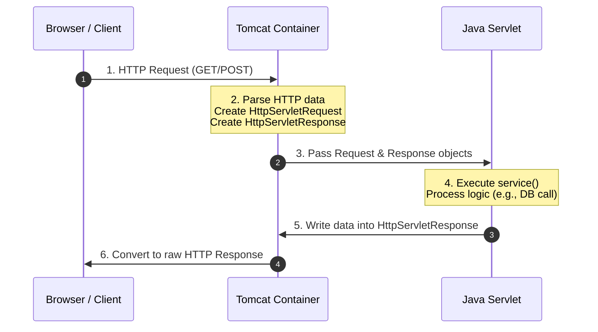

##### How to websites and internet works 

It is a client server architecture
Request are send by HTTP/HTTPS protocol 
![[Pasted image 20260617223150.png]]
client can be browser,mobile app,react front-end,postman,server(as server server in micro-services) ...
Will take request -> process it -> send response
###### HTTP: hyper text transfer protocol
There is need of a language for client server => provides proper format
It tells about 
- request structure
- response structure
- GET,POST,DELETE,PUT,PATCH
- how data will be send(`http` is non-encrypted,`https` is encrypted)
It gives rules to talk between client and server
![[Pasted image 20260624230007.png]] 
server will entertain the request
### Request
it consists of 

Methods Name : GET/POST/DELETE/PUT/PATCH
URL path : `https://www.example.com`
Headers : key value properties(meta-data response)
Body : data to be send to server or send by user
```bash
POST /login
Host : www.example.com
content-Type : application/json
{
	email:"jdsfhk@ksj.j",
	password:"*******"
}
```
server will send a response based of type => HTTP response
Status code
200 -> OK
201 -> Made some resource
503 -> internal server error 
404 -> resource not found
response can be of form
```bash
200 OK
ContentType: application/json
Content :{
	message:"Login successfull"
}
```
## Core java
We know java programming language. we can use to write back-end code for server
```java
public class Main{
	public static void main(){
		
	}
}
```
`main.java` -javac-> `main.class` -java-> execute
JVM is a process in CPU
java code runs on server => everything in java is object
observation
- java code is set of instruction -> runs -> but a website runs forever 
- server should response every-time to any request
- keep running looking for request
can make infinite loop => can make website
because -> website stays up continues
How to map end point to method
![[Pasted image 20260626210813.png]]
reading request,response,URL,headers etc => is to be handled by something else can also be done by core java
but `java.net` -> java gives objects to handle network in code like
- `serverSocket` => pass it port number 
apps runs on a port internally
```java
serverSocket server=new serverSocket(8080);
```
if can do networking in java why use framework like spring boot??
- low level code is hard and may not follow industry standards which leads to too long boiler plates
localhost -> 127.0.0.1
- java code not understands HTTP request will consider it as stream of data(need to handle it by own)
	- read input stream
	- parse request manually
	- map a method to an end point manually
	- build HTTP response to client manually
	- manually implement multi-threading for handling many request together
solved by `Servlet` and `Serlet Container`
### Servlet
it is a first java package made to handle HTTP -> in 1997
Servlet containers(it decides which Servlet to call) is called a server 
there are many types of servers 
- Tom cat(most used)
- jetty
- under tone
### Tom cat 
it is a Servlet container in which Servlet runs
it handle all boiler plate of request and response(multi-threading internally)
- open port
- read incoming bytes
- pass HTTP request
- manage threads
- create HTTP response
Servlet response as HTTP-Servlet response and request

this solved website problem for java
### Spring framework
Servlet is interconnected so hard to scale
spring loss couple it so make it easy to scale
Spring is a ecosystem, which has many frameworks inside it.
Spring can be used to make any type of application
https://spring.io/
##### Spring core
It is ideology of spring => dependency injection, inversion of control and bean ...
above it has many modules

```mermaid
graph TD
    %% Wrapper Layer
    subgraph BootLayer [Abstraction & Configuration Wrapper]
        SB["Spring Boot<br/>(Auto-Configuration, Embedded Servers, Starters)"]
    end

    %% Module Layer
    subgraph Modules [Specialized Functional Ecosystem Modules]
        MVC["Spring MVC<br/>(REST APIs & Web Apps)"]
        Data["Spring Data<br/>(JPA, Hibernate, Databases)"]
        AOP["Spring AOP<br/>(Aspect-Oriented / Cross-cutting)"]
        Sec["Spring Security<br/>(AuthN, AuthZ, OAuth2)"]
    end

    %% Foundation Layer
    subgraph CoreLayer [Foundational Bedrock]
        SC["Spring Core Container<br/>(IoC Container, Dependency Injection, Beans)"]
    end

    %% Structural Layer Connections
    SB --> MVC
    SB --> Data
    SB --> AOP
    SB --> Sec

    MVC --> SC
    Data --> SC
    AOP --> SC
    Sec --> SC

    %% Styling Elements
    classDef default fill:#1e1e2e,stroke:#cdd6f4,stroke-width:2px,color:#cdd6f4;
    classDef bootStyle fill:#a6e3a1,stroke:#a6e3a1,stroke-width:2px,color:#11111b;
    classDef moduleStyle fill:#fab387,stroke:#fab387,stroke-width:2px,color:#11111b;
    classDef coreStyle fill:#2a2b3d,stroke:#fab387,stroke-width:2px,color:#fab387;

    class SB bootStyle;
    class MVC,Data,AOP,Sec moduleStyle;
    class SC coreStyle;
    
    style BootLayer fill:#11111b,stroke:#a6e3a1;
    style Modules fill:#11111b,stroke:#fab387;
    style CoreLayer fill:#11111b,stroke:#fab387;
```

spring boot idea is 
- make fast application using automation
- it is opinionated system to boot up fast
- it has it's own ideas(opinionated) => has pre-build config assuming something which can be change config
other will ask for many manual config.
### Spring data
Use to connect to DB
previously use JDBC(java data base connectivity) => uses SQL queries
then, method replaced queries by JPA(java persistence API) -> it is implemented by hibernate(which uses JDBC internally).

```mermaid
graph TD
    %% Client & Network Entry
    Client["Client / Browser<br/>(User Interface Layer)"] -->|1. HTTP Request| SB["SpringBoot Application<br/>(Embedded Tomcat Server)"]

    %% Core Engineering Context Abstraction
    subgraph CoreEngine ["Spring Core Bedrock Container"]
        SB --- MVC["Spring MVC<br/>(Controllers & Routing)"]
        SB --- SEC["Spring Security<br/>(Authentication Filter)"]
        SB --- AOP["Spring AOP<br/>(Aspects & Transactions)"]
        MVC & SEC & AOP --- Core["Inversion of Control Container<br/>(Dependency Injection & Beans)"]
    end

    %% Database Pipeline Architecture
    SB -->|2. Invoke Service & Repository| JPA["Spring Data JPA<br/>(Repository Specifications)"]
    JPA -->|3. Entity Mapping translation| Hib["Hibernate Engine<br/>(Object-Relational Framework)"]
    Hib -->|4. Native SQL String generation| JDBC["JDBC Driver Manager<br/>(Connection Pooling / HikariCP)"]
    JDBC -->|5. Low-Level TCP Execution| DB[("Database Resource<br/>(PostgreSQL / MySQL / Atlas)")]

    %% Styling Matrix for High-Contrast Scannability
    classDef default fill:#1e1e2e,stroke:#cdd6f4,stroke-width:2px,color:#cdd6f4;
    classDef clientStyle fill:#d1d5db,stroke:#9ca3af,stroke-width:2px,color:#11111b;
    classDef springStyle fill:#022c22,stroke:#10b981,stroke-width:2px,color:#ffffff;
    classDef intermediateStyle fill:#1e1b4b,stroke:#818cf8,stroke-width:2px,color:#e0e7ff;
    classDef dbStyle fill:#991b1b,stroke:#f87171,stroke-width:2px,color:#fef2f2;

    class Client clientStyle;
    class SB,MVC,SEC,AOP,Core springStyle;
    class JPA,Hib,JDBC intermediateStyle;
    class DB dbStyle;

    style CoreEngine fill:#11111b,stroke:#10b981,stroke-dasharray: 5 5;
```

## What is micro-services
 it is a architecture to build apps => will have many service which will call each other (like payment, order, user etc)
 This leads to 2 way for spring architecture
 - mono-licit architecture : everything in one app
 - micro-service architecture : many apps talking to each other
 this make java full stack developer
 