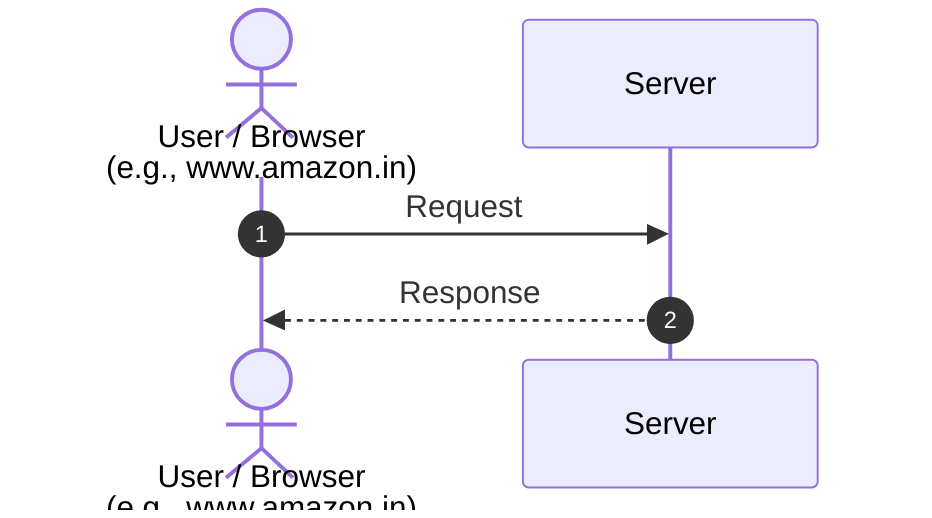

##### How to websites and internet works 

It is a client server architecture
Request are send by HTTP/HTTPS protocol 
![[Pasted image 20260617223150.png]]
client can be browser,mobile app,react front-end,postman,server(as server server in micro-services) ...
Will take request -> process it -> send response
###### HTTP: hyper text transfer protocol
There is need of a language for client server => provides proper format
