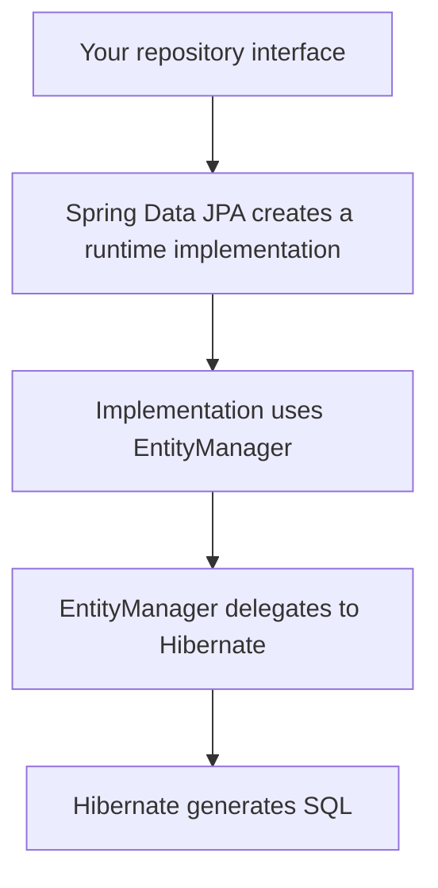
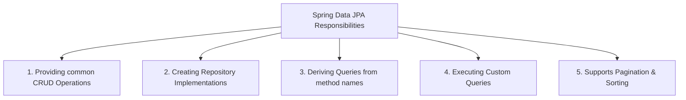

Spring JDBC -> ![[Pasted image 20260822131807.png]]
Hibernat -> ![[Pasted image 20260822131906.png]]
Problem is persistence layer is boiler plate.
![[Pasted image 20260822135930.png]]
in any repository same boilerplate need to be use, repeatative.
Spring remove this also ![[Pasted image 20260822140658.png|409]]
Thus no need define function it will make it.
It will provide defination of function at runtime.
## Spring Data
It is a umberlla -> works for any persistent logic SQL,anything.![[Pasted image 20260822144706.png]]
implementation is provided by this models.
JPA provides 
- Annotation -> `@Enity`,`@Column
```java
public interface StudentRepository extends JpaRepository<Student, Long>{
}
```
interface needs entity and primary key type.
can save using it
```java
    public Student save(Student student) {
        return studentRepository.save(student);
    }
    public Student getById(Long id) {
        return studentRepository.findById(id).orElse(null);
    }
```
Spring JPA implemented this save method and find method.
full boilerplate code is avoided.
journey -> ![[Pasted image 20260823121034.png]]

#### Spring Data interface
![[Pasted image 20260823121734.png]]
all relation are implements and all are interfaces.
- `Repository` -> it is marker empty interface, no method save or findById
```java
public interface StudentRepository extends Repository<Student, Long>{
    void save(Student student);
    Optional<Student> findById(Long id);
}
```
Spring Data JPA will understand by name of the method and make a implementation for it and will work.
it is good we can give declaration of what method needed.
- `CrudRepository` -> it has save,findById etc CRUD operation in it.
- `ListCrudRepository` -> it has bulk operations
- `PagingSortingRepository` -> many things to fetch get by count. like 1 page will have 10 users only next page next 10 user and so on. also sorting by rank give to 10.
```java
@NoRepositoryBean
public interface PagingAndSortingRepository<T, ID> extends Repository<T, ID> {
    Iterable<T> findAll(Sort sort);

    Page<T> findAll(Pageable pageable);
}
```
- `ListPagingSortingRepository` -> it give List instead of literable.
- `JpaRepository` -> has above all methods + some extra JPA specific like `flush`,`saveAndFlush`,in batch.

example create implements based on name
```java
public interface StudentRepository extends JpaRepository<Student, Long>{
    public Optional<Student> findByName(String name);
    public Optional<Student> findByEmail(String email);
}
```
working:
it will make a proxy and pass it -> ![[Pasted image 20260823134452.png]]
there is a class `SimpleJPARepository` which is written by JPA which overide the declared method in interface.
![[Pasted image 20260823142341.png]]
other methods are make at runtime.
This logic is already written and thus, it works.
![[Pasted image 20260823142911.png]]
2. Now non-standard method -> `findByName` this will go to the other direction there is a methodName to query generator.![[Pasted image 20260823143434.png]]
Thus by this 2 class will do all the JPA data stuff.
as all things are there -> we have persistence context dirtly checking and all logic.
### Basic method
1. `save()` -> will call it `persist`. and store in peristence context and flush to DB when method returns. -> also can use merge(detached entity is again attached)![[Pasted image 20260823145339.png]]
2. `saveAll()` -> take list of object and instead of saving them in 1 query it loop and put in persistence context on by one -> to get minimize query time and take advantage of persistence context i.e N+1 problem. also do batch operation using persistence context.
3. `findById(id)` -> it will do find on persistent context
4. `existById()` -> check true or false. it uses count query if not in persistent context.
5. `count()`,`delete()`,`deleteById()`.
similar -> `flush()`,`saveAndFlush()`.
### MethodName to query infrastructure
There are pattern of name to make the functionality.
like update methods
```java
    public Student update(Long id, Student student) {
        Optional<Student> studentData = studentRepository.findById(id);
        Student newstudent = studentData.get();
        student.setName(student.getName());
        return newstudent;
    }
```
it works via persistence context.
method name is in parts like `findByEmail`->![[Pasted image 20260824202904.png|210]]
there is engine which breaks words and make the function.
in predicate can also use logical operators And,Or,Not.
like `findEmailAndAge(Email,Age)`.
predicate -> ![[Pasted image 20260824205151.png]]
like query is like ![[Pasted image 20260824205920.png]] % can have any thing at there place.
can use Order by ![[Pasted image 20260824213035.png]]
### Custom query
why needed as method name can do it ?
- sometime name can become complex and very long.
like `findTop10ByNameContainingIgnoreCaseAndAgeGreaterThanAndActiveTrueAndDepartmentNameOrderByAdmissionDateDesc(string name,int age)`.
- there is many confusion.
```java
    @Query(value = """
                select * from student
                where email = :email
            """, nativeQuery = true)
    Optional<Student> find(@Param("email") String email);
```
or can do by order of arguments
```java
    @Query(value = """
                select * from student
                where email = ?1 AND name = ?2
            """, nativeQuery = true)
    Optional<Student> find( String email,String name);
```
nativeQuery = true ==> means it is SQL query by nature.
Other type of query is JPQL(Jakarata persistence query language).
It is similar to SQL but not need to table-wise want to do by entity.
```java
// SQL
Select * from student
where email=:email

// JPQL use entity Student and also like for each loop
select s from Student s
where s.email=:email
```
#### Joins
in JPQL can have 2 joints.
let example ![[Pasted image 20260825192036.png]]
```java
// Explicit joins
select s from Student s
JOIN s.department d
Where d.active = true
```
no need to mention departmentId which student table has as a foreign key.
Implicit join -> join without
```java
// implicit join
select s from Student s
where s.department.active=true
```
this 2 will do same thing SQL
```SQL
select * from student JOIN Department d Where d.active=true
```
HQL(hiberate query language) -> is same as JPQL which is written in hibernate.
## Pagination and sorting
#### Sorting
if need to use `ORDER BY` by using sort class.
```java    
	public List<Student> getAll(String name) {
        Sort sort = Sort.by("age").descending();
        List<Student> studentList = studentRepository.findAll(sort);
        for(Student s:studentList) System.out.println(s);
        return studentList;
    }
```
other ways
```java
        Sort sort = Sort.by("age").descending();
        Sort sort=Sort.by(Sort.Direction.ASC,"age");
        Sort sort=Sort.by(Sort.Direction.ASC,"name")
            .and(Sort.by(Sort.Direction.DESC,"age"));
```
#### Pagination
can't fetch all if need only 10.
like show only some amount of data at once from the DB.
it has 2 variables `Page number` and `page size`.
It has interface Pageable which methods like findAll expects as overload.
```java
        Pageable pageAble=PageRequest.of(0,2); // pageNumber,pageSize
```
page by page like ![[Pasted image 20260825203502.png]]
now for page ->  ![[Pasted image 20260825203739.png]] will give 41,50 elements.
```java
    public List<Student> getAll(String name) {
        Pageable pageAble = PageRequest.of(0, 2);
        Page<Student> studentList = studentRepository.findAll(pageAble); // page has data and meta data
        for (Student s : studentList.getContent())
            System.out.println(s);
        return studentList.getContent();
    }
```
this page number and page size can be dynamically controlled by query parameter.
Page has methods
```java
Page<Student> page = 
        studentRepository.findByActiveTrue(
                pageable
        );

page.getContent();
page.getNumber();
page.getSize();
page.getNumberOfElements();
page.getTotalElements();
page.getTotalPages();
page.hasNext();
page.hasPrevious();
page.isFirst();
page.isLast();
page.getTotalElements();
page.getTotalPages();
```
all things can be checked.
Page is child of Slice ![[Pasted image 20260825204825.png]]
slice don't have `.getTotalElemets()` and `.getTotalPages()`.
rest all thing are same.
logic different slice v/s page.
slice can be irregular from between any size(different size slices) but page is regular slice with fixed pagesize(all slice of same size).
Page does 2 query for that extra data. -> does count query.
Slice does only 1 query.
Slice is slightly faster.
