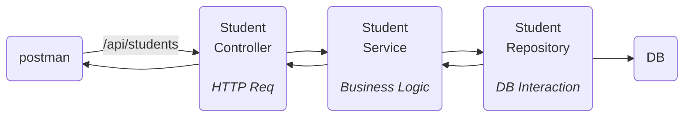

Connect spring boot => with connect DB.
can do CRUD(Create Read Update Delete) operation on it.
This is base of all projects.
![[Pasted image 20260715163952.png]]
can do request on our server and get data.
patch -> soft delete(in table mark as deleted not actually deleting the data).
SQL query => written by spring JPA.
will use hibernate.
## Setup
will have to make client server architecture.

---
HTTP methods :-
Create -> POST
Read -> GET
Update -> PUT
Delete -> DELETE
soft delete -> PATCH

---
client => can be front-end(website,mobile app) or postman.
server => localhost for now.

request and response will be in format.
```bash
POST: /api/students
Host: localhost:8000
Header: {
	Accept:application/json,
	Content-type:application/json
}
Body: {
	name:"Meow",
	...
}
```
for data base will need to have `MySql`.

---
DB -> relation DB ==> `MySql`.
can use GUI for `Dbeaver`,`Workbench` => for DB.
## Spring boot
need more dependency as making a CURD.
- new spring boot web
- mysql-driver
- spring data JPA
![[Pasted image 20260715180101.png]]
```xml
	<dependencies>
		<dependency>
			<groupId>org.springframework.boot</groupId>
			<artifactId>spring-boot-starter-data-jpa</artifactId>
		</dependency>
		<dependency>
			<groupId>org.springframework.boot</groupId>
			<artifactId>spring-boot-starter-webmvc</artifactId>
		</dependency>
		<dependency>
			<groupId>com.mysql</groupId>
			<artifactId>mysql-connector-j</artifactId>
			<scope>runtime</scope>
		</dependency>
	</dependencies>
```
error => as DB config. => as `@EnableAutoConfiguration`
need those fields in `application.properties`
for now can exclude it and run.
```java
@SpringBootApplication(exclude = {DataSourceAutoConfiguration.class})
public class CurDspringBootDemoApplication {
    public static void main(String[] args) {
        SpringApplication.run(CurDspringBootDemoApplication.class, args);
        System.out.println("Hello, World!");
    }
}
```
server is started tomcat server started at port 8080.
![[Pasted image 20260715181255.png]]
```java
@Component
public class StudentService {
    // 1. end point listen(/app/student POST)
    // 2. business(store data)
    // 3. interact with DB
    // 4. Response back to client
}
```
need to separate responsibility to other files.


This is Controller-service-repository architecture.
stores student information need a POJO(plain old java object) class of student `Student.java`. -> called as entity class(class which want to be stored in DB)
to store data from DB and get DB.(convert to that class to validate also).


