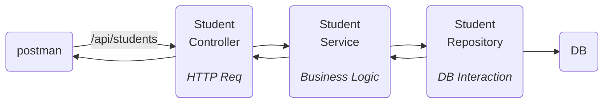

Connect spring boot => with connect DB.
can do CRUD(Create Read Update Delete) operation on it.
This is base of all projects.
![[Pasted image 20260715163952.png]]
can do request on our server and get data.
patch -> soft delete(in table mark as deleted not actually deleting the data).
SQL query => written by spring JPA.
will use hibernate.
## Setup
will have to make client server architecture.

---
HTTP methods :-
Create -> POST
Read -> GET
Update -> PUT
Delete -> DELETE
soft delete -> PATCH

---
client => can be front-end(website,mobile app) or postman.
server => localhost for now.

request and response will be in format.
```bash
POST: /api/students
Host: localhost:8000
Header: {
	Accept:application/json,
	Content-type:application/json
}
Body: {
	name:"Meow",
	...
}
```
for data base will need to have `MySql`.

---
DB -> relation DB ==> `MySql`.
can use GUI for `Dbeaver`,`Workbench` => for DB.
## Spring boot
need more dependency as making a CURD.
- new spring boot web
- mysql-driver
- spring data JPA
![[Pasted image 20260715180101.png]]
```xml
	<dependencies>
		<dependency>
			<groupId>org.springframework.boot</groupId>
			<artifactId>spring-boot-starter-data-jpa</artifactId>
		</dependency>
		<dependency>
			<groupId>org.springframework.boot</groupId>
			<artifactId>spring-boot-starter-webmvc</artifactId>
		</dependency>
		<dependency>
			<groupId>com.mysql</groupId>
			<artifactId>mysql-connector-j</artifactId>
			<scope>runtime</scope>
		</dependency>
	</dependencies>
```
error => as DB config. => as `@EnableAutoConfiguration`
need those fields in `application.properties`
for now can exclude it and run.
```java
@SpringBootApplication(exclude = {DataSourceAutoConfiguration.class})
public class CurDspringBootDemoApplication {
    public static void main(String[] args) {
        SpringApplication.run(CurDspringBootDemoApplication.class, args);
        System.out.println("Hello, World!");
    }
}
```
server is started tomcat server started at port 8080.
![[Pasted image 20260715181255.png]]
```java
@Component
public class StudentService {
    // 1. end point listen(/app/student POST)
    // 2. business(store data)
    // 3. interact with DB
    // 4. Response back to client
}
```
need to separate responsibility to other files.


This is Controller-service-repository architecture.
stores student information need a POJO(plain old java object) class of student `Student.java`. -> called as entity class(class which want to be stored in DB)
to store data from DB and get DB.(convert to that class to validate also).

--- 
#### Implementation
folder structure(organize) => ![[Pasted image 20260715195443.png|290]]
for DB give this data ![[Pasted image 20260715195038.png]]
student class
```java
package sachin.yadav.CURDspringBootDemo.entity;

public class Student {
    private String name;
    private int age;
    private String email;
    private int rollNo;
    private String subject;
    
    public void setName(String name) {
        this.name=name;
    }
    public void setAge(int age) {
        this.age=age;
    }
    public void setEmail(String email) {
        this.email=email;
    }
    public void setRollNo(int rollNo) {
        this.rollNo=rollNo;
    }
    public void setSubject(String subject) {
        this.subject=subject;
    }

    public String getName() {
        return name;
    }
    public int getAge() {
        return age;
    }
    public String getEmail() {
        return email;
    }
    public int getRollNo() {
        return rollNo;
    }
    public String getSubject() {
        return subject;
    }
}
```
need to convert JSON to java code.
link controller and service.
write SQL query to make table for it
```sql
CREATE TABLE student(
	id BIGINT AUTO_INCREMENT PRIMARY KEY,
	name VARCHAR(255),
	age INT NOT NULL,
	email VARCHAR(255),
	roll_no INT NOT NULL,
	subject VARCHAR(255)
);
```
![[Pasted image 20260716172320.png]]
now in DB ![[Pasted image 20260716172539.png]]
need code for converting student table to class and vice versa.
```sql
Insert into student values(
23,
"Sachin",
23,
"Sachin@gmail.com",
101,
"Spring Boot"
);
```
add new data![[Pasted image 20260716174116.png]]
data base interaction will be done by student repository class. => convert object of student into a row of DB table.
we will not write SQL query it will be done by JDBC.
JPA work above => JDBC.
make entity need to give primary key(which column will be unique for the table)
need JPA to write the query to create table
```java
@Entity
public class Student {
    @Id
    private Long id;

    private String name;
    private int age;
    private String email;
    private int rollNo;
    private String subject;
	// gets and setter for field
}
```
it not component by default.
need to map request routes => to a function
```java
@RestController // has internally Controller in Component 
public class StudentController {
    // Create student
    public void createStudent(){
    }
    // Read student
    public void readStudent(){
    }

    // Update student
    public void updateStudent(){
    }

    // Delete student
    public void deleteStudent(){
    }
}
```
need to map this function to end points
![[Pasted image 20260716190856.png]]
in update will update everything
here common is `/api/students/`
```java
@RestController
@RequestMapping("/api/students")
public class StudentController {
    @PostMapping("")
    public void createStudent(@RequestBody Student student){
        System.out.println(student.getName());
        System.out.println(student.getEmail());
    }
}
```
now need to revive the JSON we get in post request.
this is mapped to Student class using `jkson` library => to convert JSON to java class.
![[Pasted image 20260716194806.png]]
in console
```bash
Saa 
Sachin@gamil.com
```
end point is correctly mapped.
#### Connect controller with service
controller -> will handle API request and response.
service -> will do business logic and act as layer between controller and repository.
repository -> will handle DB stuff.
```java
@Service // includes component internally *Specialized annotation*
public class StudentService {
    private StudentRepository studentRepository;

    public StudentService(StudentRepository studentRepository){
        this.studentRepository = studentRepository;
    }

    public Student createStudent(Student studentReq){
        // business logic --> apparently not present
        // store to DB --> will be done by repository
        Student studentRes = studentRepository.saveStudent(studentReq);
        return studentRes;
    }
}

@RestController
@RequestMapping("/api/students")
public class StudentController {
    private StudentService studentService;

    public StudentController(StudentService studentService){
        this.studentService = studentService;
    }

    @PostMapping("")
    public String createStudent(@RequestBody Student student){
        Student createStudent = studentService.createStudent(student);
        return "Student created";
    }
}
```
need to make logic for save student.
![[Pasted image 20260717175643.png]]
![[Pasted image 20260717180004.png]]
need to pass as response if created else null.
```java
@RestController
@RequestMapping("/api/students")
public class StudentController {
    private StudentService studentService;

    public StudentController(StudentService studentService){
        this.studentService = studentService;
    }

    @PostMapping("")
    public Student createStudent(@RequestBody Student student){
        System.out.println("In side StudentController");
        Student createStudent = studentService.createStudent(student);
        return createStudent;
    }
}
```
![[Pasted image 20260717180055.png]]
again `jkason` converted class to JSON.
by default response code is 200 OK.
if need specific thing as created new thing should send 201 -> created new resource.
```java
    @PostMapping("")
    public ResponseEntity<Student> createStudent(@RequestBody Student student){
        System.out.println("In side StudentController");
        Student createStudent = studentService.createStudent(student);
        return ResponseEntity.status(201).body(createStudent);
        //OR  return ResponseEntity.status(HttpStatus.CREATED).body(createStudent);
    }
```
## DB connection
repository layer will interact with DB(CRUD).
will use methods of JPA(Jakarta persistent API) instead of SQL query.
methods 
- `save()` -> Insert into student();
- `findAll()` -> select * from student;
- `find()` -> select * from student where ...;
- `deleteById()` -> delete 
- `save()` -> update
- `existById()` -> check if id exist
need to make it interface(so no need to write query manually just give generic and define) and extends `JpaRepository<Entity object, data type of primary key>`.
```java
@Repository // uses Component internally (it is optionaly)
public interface StudentRepository extends aJpaRepository<Student,Long> {
   
}
```
now will have all methods in it.
```java
    public Student createStudent(Student studentReq){
        // business logic --> apparently not present
        // store to DB --> will be done by repository
        Student studentRes = studentRepository.save(studentReq);
        return studentRes;
    }
```
why it works without override.![[Pasted image 20260718103720.png|235]]
- at run time spring data JPA will provide implementation.
- use methods directly without providing implementations.
if complex query then will give implementation.
##### configure DB 
make new DB connection in `DBeaver` ![[Pasted image 20260718105310.png]]
get `MySql` give host name DB name password.![[Pasted image 20260718105728.png]]
make sure DB running using this command
https://chatgpt.com/share/6a5b108d-4960-83ee-a0b8-04a9ee3f712c
now DB connects![[Pasted image 20260718110621.png|249]]![[Pasted image 20260718110716.png|251]]
make a student crud DB using this query ![[Pasted image 20260718111054.png]]
table will be created by JPA(only need to create a DB).
in property file
```properties
spring.application.name=CURDspringBootDemo

spring.datasource.url=jdbc:mysql://localhost:3306/student_crud_db
spring.datasource.username=root
spring.datasource.password=root123
spring.jpa.hibernate.ddl-auto=update
spring.jpa.show-sql=true

spring.datasource.driver-class-name=com.mysql.cj.jdbc.Driver
spring.jpa.properties.hibernate.dialect=org.hibernate.dialect.MySQLDialect
```
`hibernate.ddl-auto` make table automatically based on entity.
`ddl`->data definition language.
`jpa.show-sql` -> log SQL query![[Pasted image 20260718120611.png]]
why running program will get table ![[Pasted image 20260718112335.png]]
works can add data using API call via postman.
when do save it does
- select to check if same id student exist
	- if yes -> update
	- if no -> create
### Get 
can get id from path variable, or search params.
```java
// controller
    @GetMapping("/{id}")
    public ResponseEntity<Student> getStudent(@PathVariable Long id){
        Student student = studentService.getStudent(id);
        return ResponseEntity
            .status(HttpStatus.OK)
            .body(student);
    }

// service
    public Student getStudent(Long id){
        return studentRepository.findById(id).get();
    }

// repository will handle it by JPA
```
find by id -> gives optional as entry may exist or may not.
it works and internally use select query.
if get null need to handle it
```java
    @GetMapping("/{id}")
    public ResponseEntity<Student> getStudent(@PathVariable Long id){
        Student student = studentService.getStudent(id);
        if (student==null) {
            return ResponseEntity.status(HttpStatus.NOT_FOUND).body(null);
        }
        return ResponseEntity
            .status(HttpStatus.OK)
            .body(student);
    }
```
for getting all students
```java
// controller
    @GetMapping()
    public ResponseEntity<List<Student>> getAllStudent(){
        List<Student> list = studentService.getAllStudent();
        if(list.isEmpty()){
            return ResponseEntity.status(HttpStatus.NOT_FOUND).body(null);
        }
        return ResponseEntity
            .status(HttpStatus.OK)
            .body(list);
    }

// service
    public List<Student> getAllStudent(){
        List<Student> studentRes=studentRepository.findAll();
        return studentRes;
    }
```
for update and delete
```java
// controller
    @PutMapping("/{id}")
    public ResponseEntity<Student> updateStudent(@PathVariable Long id, @RequestBody Student student){
        Student studentRes = studentService.updateStudent(id,student);
        if(studentRes==null){
            return ResponseEntity.status(HttpStatus.NOT_FOUND).body(null);
        }
        return ResponseEntity
            .status(HttpStatus.OK)
            .body(studentRes);
    }
    @DeleteMapping("/{id}")
    public ResponseEntity<String> deleteStudent(@PathVariable Long id){
        boolean isDeleted = studentService.deleteStudent(id);
        if(!isDeleted){
            return ResponseEntity.status(HttpStatus.NOT_FOUND).body("Record not found");
        }
        return ResponseEntity.status(HttpStatus.OK).body("Record deleted");
    }

// service
    public Student updateStudent(Long id,Student studentReq){
        Student studentExisting = studentRepository.findById(id).get();
        if(studentExisting==null) return null;
        Student studentStore=studentExisting;
        studentStore.setName(studentReq.getName());
        studentStore.setRollNo(studentReq.getRollNo());
        studentStore.setAge(studentReq.getAge());
        studentStore.setEmail(studentReq.getEmail());
        studentStore.setSubject(studentReq.getSubject());
        studentRepository.save(studentStore);
        return studentStore;
    }
    public boolean deleteStudent(Long id){
        boolean exists=studentRepository.existsById(id);
        if(!exists) return false;
        studentRepository.deleteById(id);
        return true;
    }
```
in update can't set id => good practice.
## Soft delete
will mark true to column of `isDeleted` based on it will do other crud operations.
