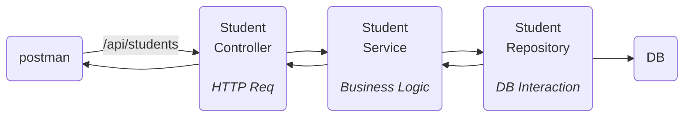

Connect spring boot => with connect DB.
can do CRUD(Create Read Update Delete) operation on it.
This is base of all projects.
![[Pasted image 20260715163952.png]]
can do request on our server and get data.
patch -> soft delete(in table mark as deleted not actually deleting the data).
SQL query => written by spring JPA.
will use hibernate.
## Setup
will have to make client server architecture.

---
HTTP methods :-
Create -> POST
Read -> GET
Update -> PUT
Delete -> DELETE
soft delete -> PATCH

---
client => can be front-end(website,mobile app) or postman.
server => localhost for now.

request and response will be in format.
```bash
POST: /api/students
Host: localhost:8000
Header: {
	Accept:application/json,
	Content-type:application/json
}
Body: {
	name:"Meow",
	...
}
```
for data base will need to have `MySql`.

---
DB -> relation DB ==> `MySql`.
can use GUI for `Dbeaver`,`Workbench` => for DB.
## Spring boot
need more dependency as making a CURD.
- new spring boot web
- mysql-driver
- spring data JPA
![[Pasted image 20260715180101.png]]
```xml
	<dependencies>
		<dependency>
			<groupId>org.springframework.boot</groupId>
			<artifactId>spring-boot-starter-data-jpa</artifactId>
		</dependency>
		<dependency>
			<groupId>org.springframework.boot</groupId>
			<artifactId>spring-boot-starter-webmvc</artifactId>
		</dependency>
		<dependency>
			<groupId>com.mysql</groupId>
			<artifactId>mysql-connector-j</artifactId>
			<scope>runtime</scope>
		</dependency>
	</dependencies>
```
error => as DB config. => as `@EnableAutoConfiguration`
need those fields in `application.properties`
for now can exclude it and run.
```java
@SpringBootApplication(exclude = {DataSourceAutoConfiguration.class})
public class CurDspringBootDemoApplication {
    public static void main(String[] args) {
        SpringApplication.run(CurDspringBootDemoApplication.class, args);
        System.out.println("Hello, World!");
    }
}
```
server is started tomcat server started at port 8080.
![[Pasted image 20260715181255.png]]
```java
@Component
public class StudentService {
    // 1. end point listen(/app/student POST)
    // 2. business(store data)
    // 3. interact with DB
    // 4. Response back to client
}
```
need to separate responsibility to other files.


This is Controller-service-repository architecture.
stores student information need a POJO(plain old java object) class of student `Student.java`. -> called as entity class(class which want to be stored in DB)
to store data from DB and get DB.(convert to that class to validate also).

--- 
#### Implementation
folder structure(organize) => ![[Pasted image 20260715195443.png|290]]
for DB give this data ![[Pasted image 20260715195038.png]]
student class
```java
package sachin.yadav.CURDspringBootDemo.entity;

public class Student {
    private String name;
    private int age;
    private String email;
    private int rollNo;
    private String subject;
    
    public void setName(String name) {
        this.name=name;
    }
    public void setAge(int age) {
        this.age=age;
    }
    public void setEmail(String email) {
        this.email=email;
    }
    public void setRollNo(int rollNo) {
        this.rollNo=rollNo;
    }
    public void setSubject(String subject) {
        this.subject=subject;
    }

    public String getName() {
        return name;
    }
    public int getAge() {
        return age;
    }
    public String getEmail() {
        return email;
    }
    public int getRollNo() {
        return rollNo;
    }
    public String getSubject() {
        return subject;
    }
}
```
need to convert JSON to java code.
link controller and service.
write SQL query to make table for it
```sql
CREATE TABLE student(
	id BIGINT AUTO_INCREMENT PRIMARY KEY,
	name VARCHAR(255),
	age INT NOT NULL,
	email VARCHAR(255),
	roll_no INT NOT NULL,
	subject VARCHAR(255)
);
```
![[Pasted image 20260716172320.png]]
now in DB ![[Pasted image 20260716172539.png]]
need code for converting student table to class and vice versa.
```sql
Insert into student values(
23,
"Sachin",
23,
"Sachin@gmail.com",
101,
"Spring Boot"
);
```
add new data![[Pasted image 20260716174116.png]]
data base interaction will be done by student repository class. => convert object of student into a row of DB table.
we will not write SQL query it will be done by JDBC.
JPA work above => JDBC.
make entity need to give primary key(which column will be unique for the table)
need JPA to write the query to create table
```java
@Entity
public class Student {
    @Id
    private Long id;

    private String name;
    private int age;
    private String email;
    private int rollNo;
    private String subject;
	// gets and setter for field
}
```
it not component by default.
need to map request routes => to a function
```java
@RestController // has internally Controller in Component 
public class StudentController {
    // Create student
    public void createStudent(){
    }
    // Read student
    public void readStudent(){
    }

    // Update student
    public void updateStudent(){
    }

    // Delete student
    public void deleteStudent(){
    }
}
```
need to map this function to end points
![[Pasted image 20260716190856.png]]
in update will update everything
here common is `/api/students/`
```java
@RestController
@RequestMapping("/api/students")
public class StudentController {
    @PostMapping("")
    public void createStudent(){
    }
}
```
now need to revive the JSON we get in post request.
