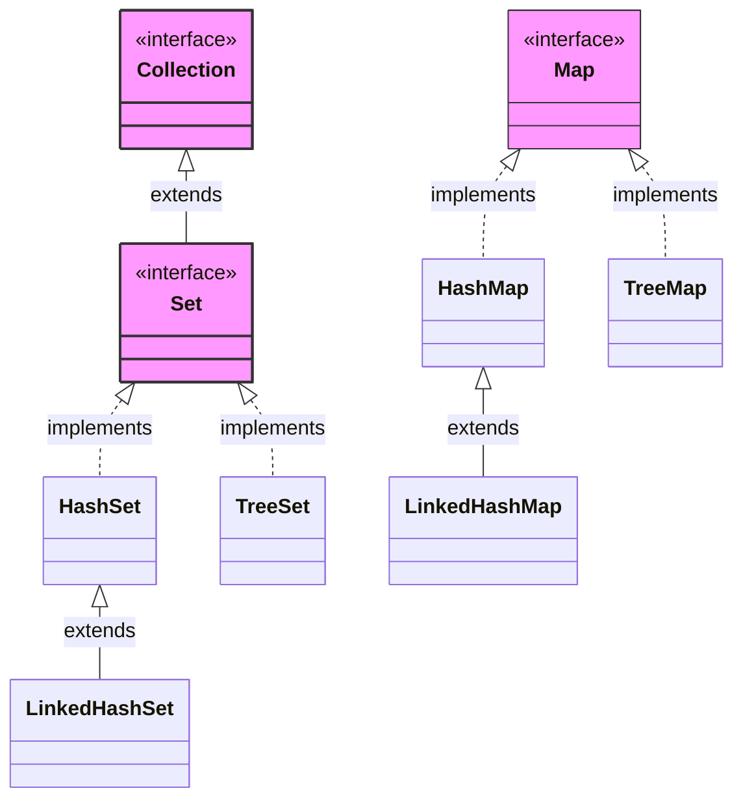

### Set
provides a contract for 
- Duplicates are not allowed
- Constant time search operation O(1)
Used for real world
- find unique
### Map
provides a contract 
- it will store key:value pair
- duplicate key not allowed
- get value at key in O(1) -> constant time search
- `map.containsKey(key)` -> O(1)
example
- roll no : name
- roll no is unique
set and map loss is 
- positional access not found(no order maintained)
```java
import java.util.*;

public class demo {
    public static void main(String[] args) {
        Set<String> s=new HashSet<>();
        s.add("Meow");
        s.add("Cat");
        s.add("Kitty");
        s.add("Cat");
        System.out.println(s); // [Meow, Cat, Kitty]
        System.out.println(s.contains("Cat")); // true
        System.out.println(s.contains("Dog")); // false

        Map<Integer,String> m=new HashMap<>();
        m.put(101,"Meow");
        m.put(102,"Cat");
        m.put(103,"Kitty");
        m.put(103,"Dog"); // update not add
        System.out.println(m); // {101=Meow, 102=Cat, 103=Dog}
        System.out.println(m.get(102)); // Cat
        System.out.println(m.containsKey(103)); // true
    }
}
```
Internal working
- array of buckets -> hashing to get value in constant time. Thus, unique 
- uses modulo(%) and other methods to has negative numbers and methods to avoid collision. like `nD` linked list with so complex logic
- for string, anything can call `.hashCode()` will give integer can be used to hash
- if hash of different value is same then, store it in the linked list at that hash value
- can store multiple in -> thus near/average time complexity O(1)
similarly in map
- can store pair as internal class and hash it like hash primitive datatype.
- hash keys and store values in buckets
## Java internals
There is nothing like `set` in java we have `map` which has all properties of same as `set`
In java, set/map are stored as map
internally set is a map(set value is key in map with dummy values)
- `s.add(2)` converts to `.put(2,PRESENT)` -> present is a `Private static final = new Object();`
- `s.contains(2)` converts to `.containsKey(2)`
has node
```java
class node<K,V>{
	K key;
	V value;
	int hash;
	Node<K,V> next;
}
```
## `HashSet`
- `.add(E e)` -> gives boolean(if duplicate then false)
```java
import java.util.*;

public class demo {
    public static void main(String[] args) {
        Set<String> s=new HashSet<>();
        s.add("Meow");
        boolean a=s.add("Cat");
        s.add("Kitty");
        boolean b=s.add("Cat");
        System.out.println(a+" "+b); // true false
    }
}
```
can add in bucket using % and check in bucket using `.equal()` to return true or false
-> maintain "if `equals()` is same then `.hashCode()` must be same" -> return true if `hashCode` and `equals` both are checked before giving true to contains
Set has no `.get()` methods only has contains method
- Collision in hash methods
	- uses linked list to chaining method(used in java)
	- open addressing(not in java) -> put to places where has place(nearest cell) shifting
### Load Factor
- no of elements at a place -> element by capacity
- if more than 75% filled array(no of element/capacity of hash array)
- does rehashing -> to avoid making long linked list using modulo(%)
- make new hash array of size => double size than previous --> rehashing 
- initial default size is 16 
- Load factor < 0.75(12) ---> false than double it
### Treefication(java 8)
- if at a node size of linked list is 8 elements
- then it convert it to BST(red black binary search tree)
- to convert O(N) -> O(logn)
set in internally uses map
### `LinkedHashSet/LinkedHashMap`
It is normal set and map 
as in general, won't get element will get in order
order of insertion and order of traversal are different(drastically)
Solved by this `LinkedHash` - Solved by using `DoublyLinkedList` to maintain order of traversal using iterator
- 1st linked list -> for hash
- 2nd linked list -> to maintain insertion order
Thus it will have overhead and extends `HashSet/HashMap`
### `TreeHashSet/TreeHashMap`
tree set uses internally uses tree map.
It used red black tree(self balancing tree)
same all operations
disadvantage
- complexity changes from O(1) -> O(logn) for all operation
advantage
- keys sorted printing
- largest / smallest element
- range query 
not uses hashing -> strings saved in lexicographical order to search(compare using BST in O(logn))
### BST
Uses self balancing by changing root(as it may skew to one side if keep adding more nodes) => using red black tree it balances by changing root
```java
class node<K,V>{
	K key;
	V value;
	Node left;
	Node right;
	Node parent;
	boolean color; // can be red or black
}
```
smaller value goes to left and higher goes to right
makes nodes and put BST for keys 
thus, used to implement map and set
it has all parent child keep each other's reference
### buckets
in set and map of `Linked` and `Hash`
- can have 1 key as null
- can have infinite null value(e.g `PRESENT` in set implementation)
but in `tree` type of set and map => uses compare instead of hashCode and 
- uses

