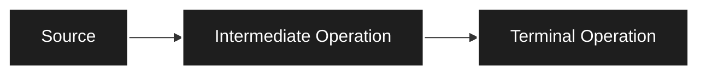
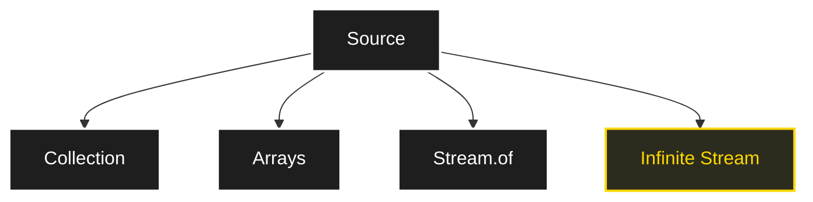
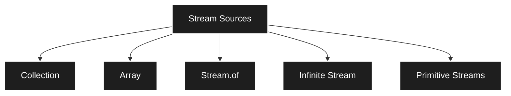
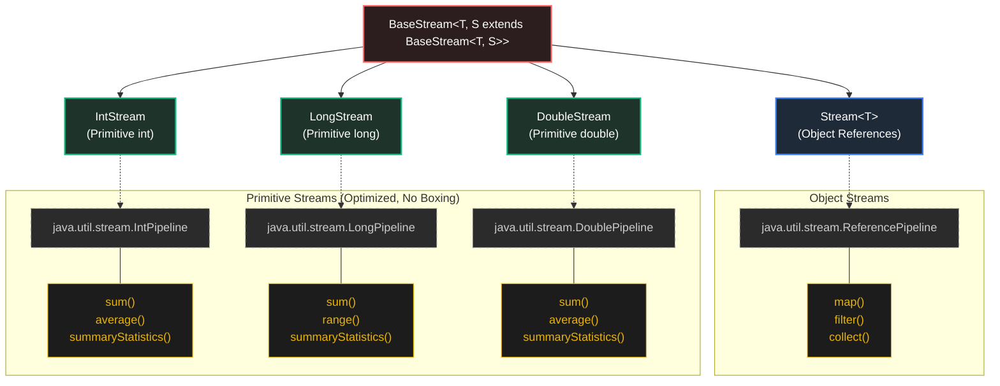

it uses lambdas
### Streams
do operation on a object like pipeline -> do sequence of operations 
normal we do imperative code(mechanics loops), need to make it declarative code(like SQL)
In collection have 
- `Stream()`
- `parallelStream()`
![[Pasted image 20260614152550.png]]
make it functional programming style 
## Streams
A stream is a tool for processing a sequence of data through a chain of operation.
Like water pipeline with may filter
stream -> data processing not collecting data 
stream work on current collection.(no other storage)
-> like connect source of pipe to the list(internally it uses `SplitIterator`)
## Stream pipeline Architecture
It has 3 components

```java
list.strema() // make source to list
	.filter(x->x>10) // below intermidate operation
	.map(x->x+2)
	.tolist(); // terminal operation(finally make a list) IMP
```
how to consume it is to be specified(optimized for it)
### Source
it can be collection ,Array, Stream.of(), infinite stream

when do `list.stream()` => it give a object of `type Stream<T>`
### Intermediate operations
it does some transformation on the stream
there are many methods in it like `.filter(Predicate interface)`,`.map(Function inteface)`,`.sort()` ..., all are methods in Stream Object
all this method return -> Stream Object(so can apply more methods)
it builds pipeline step by step
### Terminal operation
do something to end 
example `.foreach(Consumer)`,`toList()`,`Collect()`,`count()`...
it will return value/void(not a stream)

> [!Note]
> If no terminal operation stream will not be executed it is only declared => unlocks feature of Lazy loading(by design)
> Also Stream once used(taken terminal opertation) is dead

items will filter out as => (the `streamIterator`)=> does the fill transformation and termination -> for each element one by one ====> Vertical processing(one element then other)
if take all element and apply filter one then take remaining and apply filter 2 ... ====> Horizontal processing
Java uses Vertical processing optimized(Lazy evaluation)
Lazy evaluation stops as soon as like `break`(because vertical)
Stream stored -> can use only once(only can consumed once)
```java
import java.util.stream.*;
import java.util.*;

public class demo {
    public static void main(String[] args) {
        List<Integer> list = new ArrayList<>(List.of(1, 2, 3, 4, 5, 6, 7, 8, 9, 10));
        System.out.println(list); // [1, 2, 3, 4, 5, 6, 7, 8, 9, 10]
        Stream<Integer> s = list.stream();
        s.filter(i -> i % 2 == 0).map(x->x*x).forEach(System.out::println);
        // 4 16 36 64 100
    }
}
```
#### Source

there are two types of `l.stream()`,`l.parallelStream()` this parallel stream makes.(parallel processing)
Stream of array
```java
import java.util.stream.*;
import java.util.*;

public class demo {
    public static void main(String[] args) {
        String[] arr = {"a", "b", "c", "d", "e", "f", "g", "h", "i", "j"};
        Stream<String> s=Arrays.stream(arr);
        s.map(x->x.toUpperCase()).forEach(System.out::println);
        // A B C D E F G H I J
    }
}
```
directly 
```java
import java.util.stream.*;
import java.util.*;

public class demo {
    public static void main(String[] args) {
        Stream<Integer> s = Stream.of(1, 2, 3, 4, 5, 6, 7, 8, 9, 10);
        s.filter(x->x==7).forEach(System.out::println); // 7
    }
}
```
can make empty stream using `Stream.empty()` -> where need to avoid null 
Can make infinite stream by using `Stream.iterate(seed,nextFn)`,`Stream.generate(supplier)`
can do `.limit(x)` does next x times
iterate -> depends on previous value
generate -> gets infinity from supplier
if dynamic and data => use infinite stream
as Lazy evaluate thus can make stream (pause till add terminal condition)
#### Primitive stream
use Integer,Double,Long does unboxing and auto boxing thus need primitive for optimization
thus, have `IntStream`,`DoubleStream`,`LongStream` --> more efficient
```java
import java.util.stream.*;
import java.util.*;

public class demo {
    public static void main(String[] args) {
        IntStream s = IntStream.range(1, 10);
        s.filter(x->x==7).forEach(System.out::println); // 7
    }
}
```
Over all stream interface

Stream is vertical load 
can convert between stream type
object to primitive
```java
import java.util.stream.*;
import java.util.*;

public class demo {
    public static void main(String[] args) {
        Stream<Integer> n=Stream.of(1,2,3,4,5,12,3,8,4,92,5,7,7,6,54,3,21,2,345,4,32,12,345,2);
        IntStream s = n.mapToInt(x->x);
        s.filter(x->x==7).forEach(System.out::println); // 7
    }
}
```
primitive to object
```java
import java.util.stream.*;
import java.util.*;

public class demo {
    public static void main(String[] args) {
        IntStream s = IntStream.range(0, 10);
        Stream<Integer> s2 = s.boxed();
        s2.map(i -> i * 2).filter(i -> i % 3 == 0).forEach(System.out::println);
        // 0 6 12 18
    }
}
```
can convert stream between primitive using `mapToLong(x->x)`,`mapToDouble(x->x)`
