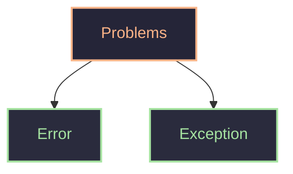
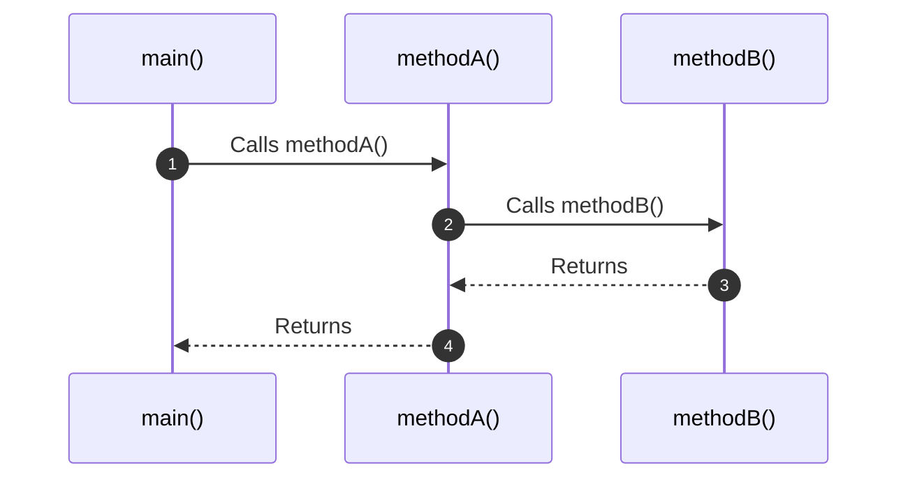

> [!abstract]
> Handle error before they occur, things won't work as per plan (divide by zero,file not found,module not found,syntax error)

As programmer and user are not perfect -> problems

#### Exception
It is a recoverable/handle-able  abnormal condition that occurs during program execution.
it is problem in flow of control 
example
- a/0 : arithmetic exception ----> fix by condition
- file not found : check to fix
#### Error(Object)
are serous problem. 
example
- `outOfMemoryError` => heap memory full
- `StackOverflowError` => stack memory full
### Problems
```java
public class demo {
    public static void main(String[] args) {
        int num = 5/0; // java.lang.ArithmeticException
        System.out.println(num);
    }
}
```
it is object
```java
public class demo {
    public static void main(String[] args) {
        main(args); // java.lang.StackOverflowError
    }
}
```
it is also object
As java is run by JVM => interpreted can 
```java
public class demo {
    public static void main(String[] args) {
        int a = 5;
        int b = 0;

        System.out.println("Step 1"); // Step 1

        System.out.println(a/b); // java.lang.ArithmeticException

        System.out.println("Step 2"); // not executed
    }
}
```
thus should handle this exception
can handle by if-else ----> not exact way
```java
public class demo {
    public static void main(String[] args) {
        int a = 5;
        int b = 0;

        System.out.println("Step 1"); // Step 1
        if(b!=0){ // preventive measure (gracefull handling)
            System.out.println(a/b);
        }
        System.out.println("Step 2"); // Step 2
    }
}
```
if not handle, 
-  JVM decides, and stops
if handle exception
- flow of control is decide
- debugging easy
- user experience better
##### Internally
JVM throws object and message
```java
JVM: new ArithmaticException("divide by zero")
```
throw message -> stops code
it will go to see if exception handle else
stop program and show error  -> default exceptional handling
call stack -> 

JVM calls main method
if exception happens it check if any one handle it 
make object of exception try to throw error 
if A handle, then if B handle 
it will print `stack Trace`
for a/0 
```java
Exception in thread "main" java.lang.ArithmeticException: / by zero
	at demo.main(demo.java:5)
```
can know in which thread exception 
message is `/ by zero`
at where exception occurred and line number
example
```java
public class demo {
    public static void main(String[] args) {
        int a = 5;
        int b = 0;
        System.out.println(method1(a, b));
    }
    public static int method1(int a, int b) {
        return method2(a, b);
    }
    public static int method2(int a, int b) {
        return a/b;
    }
}
```
exception is
```java
Exception in thread "main" java.lang.ArithmeticException: / by zero
	at demo.method2(demo.java:11)
	at demo.method1(demo.java:8)
	at demo.main(demo.java:5)
```
this is default way of exception handling in java
## Manual exception handling
our goal is 
- when an exception occurs, don't crash handle it & continue
It use try catch 
```java
try{
	// risky code
}catch(Exception e){ // here error gives exception 
	// what to do when exception codes
	// preventive measures
}
```
can handle error
```java
public class demo {
    public static void main(String[] args) {
        int a=5;
        int b=0;
        System.out.println("Step 1"); // Step 1
        try {
            System.out.println(a/b);
        } catch (ArithmeticException e) {
            System.out.println("Can't divide by zero"); // Can't divide by zero
        }
        System.out.println("Step 2"); // Step 2
    }
}
```
it check stack -> for handling here, got a handler in main only
```java
public class demo {
    public static void main(String[] args) {
        int a = 5;
        int b = 0;
        System.out.println("Step 1");
        try {
            System.out.println(method1(a, b));
        } catch (Exception e) {
            System.out.println("Exception: " + e);
        }
        System.out.println("Step 5"); 
    }
    public static int method1(int a, int b) {
        System.out.println("Step 3");
        return method2(a, b);
    }
    public static int method2(int a, int b) {
        System.out.println("Step 4");
        return a/b;
    }
}
/* O/P;
Step 1
Step 3
Step 4
Exception: java.lang.ArithmeticException: / by zero
Step 5
*/
```
but exception handle in main => but, generally need should handle it as close where do risk (like at division)
proof of stack trace
```java
public class demo {
    public static void main(String[] args) {
        int a = 5;
        int b = 0;
        System.out.println("Step 1");
        try {
            method1(a, b);
        } catch (Exception e) {
            System.out.println("Exception: " + e);
        }
        System.out.println("Step 5"); 
    }
    public static void method1(int a, int b) {
        System.out.println("Step 3");
        method2(a, b);
    }
    public static void method2(int a, int b) {
        System.out.println("Step 4");
        System.out.println(a/b);
        System.out.println("Step 6"); // never runs as not handled
    }
}
/* O/P;
Step 1
Step 3
Step 4
Exception: java.lang.ArithmeticException: / by zero
Step 5
*/
```
after exception line is un reach to print "Step 6"
this exception object has many methods like `.fillInStackTrace()`,`getCause()`,`getClass`,`getMessage()`,`printStackTrace()` etc
and can put this thing in log file to debug it.

| try catch handling               | if else prevention                |
| -------------------------------- | --------------------------------- |
| intention is to handle exception | intention is to prevent exception |
also have finally block
- which run if run anyway(always). if exception comes or not
- because try runs till exception comes after it it look for catch
- use for clean up => like have transaction open then close it in finally -> close resource log things
can handle 
- `catch(Exception e)` -> general all exception handle
- `catch(NullPointerException e)` -> particular null pointer exception is only handled
thus can write multiple catch
```java
        try {
            method1(a, b);
        } catch (NullPointerException e) {
            System.out.println("null pointer exception");
        } catch (ArithmeticException e) {
            e.printStackTrace();
        } catch (Exception e) {
            System.out.println("Unknow error");
        } finally {
            System.out.println("Finally over");
        }
```
can have 0 or more catch, and can have only 1 finally 
# Nested try catch
```java
try{
	try{
	}catch(){
	}
}catch(){
}
```
cases
- exception will be handled by the closed inner try catch. (i.e exception of inner try will be handled by its own catch if possible)
