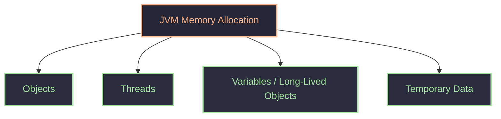
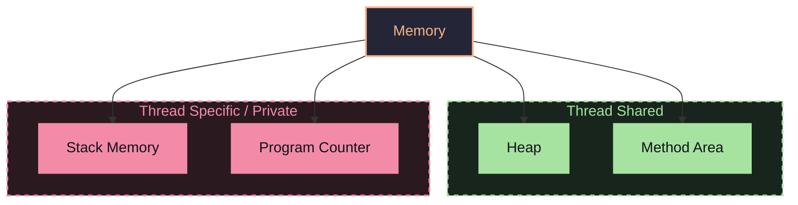

#### Memory management
need memory to store objects ,variables ,class metadata.
Way to JVM interact
- Memory allocation
- Memory use/update
- Memory de-allocate/Free
In C/C++ we have manual memory management in heap.
this is error prone => heap overflow/use-after-free, Solution is Garbage collection by JVM.
###### If have Garbage collector, why learn memory management?
- because need optimize code.
- if a reference variable is still pointing, garbage collector will not erase it.
- need to clear it immediately can't wait for garbage collector.(`OutOfMemoryError`,`StackOverflowError`)
- for performance.

#### Types of memory 

There is also `Native method stack` which helpful when java interacts with other language
- heap and method area -> is thread share(need to do locking)
- dynamic in nature can give maximum and minimum size
- while running do `-Xms2m (minimum space)` and `-Xmx4m (max space)` in MB
```java
import java.util.*;

public class demo{
    public static void main(String[] args){
        List<int[]> l=new ArgumentList<>();
        int count=0;
        while (true) {
            l.add(new int[250000]); // 1M bytes --> 1MB
            count++;
            System.err.println("Allocated "+count+" MB");
        }
    }
}
```
![[Pasted image 20260620160838.png]]
![[Pasted image 20260620160941.png]]
actually it is 1024 => thus went to 5th block
- managed by garbage collection 
- it is slower that stack as overhead of garbage collection
collector free if no reference to it in stack.(object when unreachable)
```java
Student s=new Student();
s=null; // made s eligble for garbage collection
```
or else if it happens in a methods so after return it is destroyed
- object are linked together thus will have graph like => this object can store reference to each other
##### Heap memory
It is a huge chunk of memory where objects are stored at runtime(dynamic memory).
Garbage collector works here only.
life time of objects is unpredictable => not like method to destroy after method call.
what goes in heap
- all objects
- instance variables(not instance or static methods as it is in method area)
- arrays
- string -> can go normally or in string pool
Properties of heap
- shared across thread -> need locking mech
##### Method area
It store meta-data/blue-print of class.
all information about a class -> methods 
all info to make a object of a class
all instance and static method are stored here. methods of a class are never stored in heap
##### Stack memory
also called as function call stack.
It follows LIFO, it is execution memory.
from here, stack trace is print.
It stores frame of methods running

```mermaid
graph BT
    %% Representing the stack structure where new frames sit on top
    subgraph StackMemory [Thread Stack]
        Frame1["... older stack frames ..."]
        Frame2["main() frame"]
        Frame3["methodA() frame"]
        ActiveFrame["min() frame <br><b>[Active Frame]</b>"]
        
        Frame1 --> Frame2
        Frame2 --> Frame3
        Frame3 --> ActiveFrame
    end

    %% Styling for high-contrast scannability
    classDef default fill:#1e1e2e,stroke:#cdd6f4,stroke-width:2px,color:#cdd6f4;
    classDef active fill:#f38ba8,stroke:#f38ba8,stroke-width:2px,color:#11111b;
    classDef standard fill:#2a2b3d,stroke:#fab387,stroke-width:2px,color:#fab387;
    
    class ActiveFrame active;
    class Frame2,Frame3 standard;
    style StackMemory fill:#181825,stroke:#cdd6f4,stroke-width:2px;
```

in one stack frame has
- all local variable(parameter)
- reference variables
- return address
why need return address if we have stack which uses LIFO?
- It stores line number of that method
- below is the method frame with local frame => it tells what state to resume from not location to resume
- exactly it stores program counter(exactly where to continue)
```java
public class demo{
	psvm(){
		int a=10;
		int res=add(a,20);
	}
	int add(int x,int y){
		int sum=x+y;
		return sum;
	}
}
```
stack

```mermaid
graph LR
    subgraph MainFrame [main Stack Frame]
        direction TB
        subgraph MainLVT [Local Variable Array]
            m0["Index 0: args reference"]
            m1["Index 1 (a): 10"]
            m2["Index 2 (res): [Waiting]"]
        end
    end
    style MainFrame fill:#181825,stroke:#fab387,stroke-width:2px;
    style MainLVT fill:#1e1e2e,stroke:#cdd6f4;
```

```mermaid
graph BT
    subgraph Stack [JVM Thread Stack Memory]
        direction BT
        
        subgraph MainFrame [main Frame - Suspended]
            m1["Index 1 (a): 10"]
        end

        subgraph AddFrame [add Frame - Active]
            direction TB
            subgraph AddLVT [Local Variable Array]
                a0["Index 0: this reference"]
                a1["Index 1 (x): 10"]
                a2["Index 2 (y): 20"]
                a3["Index 3 (sum): [Allocating]"]
            end
        end

        MainFrame --> AddFrame
    end

    %% Visualizing the Value Copy
    m1 -. "Value Copied<br/>(Pass-by-Value)" .-> a1

    classDef default fill:#1e1e2e,stroke:#cdd6f4,stroke-width:2px,color:#cdd6f4;
    classDef active fill:#f38ba8,stroke:#f38ba8,stroke-width:2px,color:#11111b;
    classDef mainStyle fill:#2a2b3d,stroke:#fab387,stroke-width:2px,color:#fab387;
    
    class AddFrame active;
    class MainFrame mainStyle;
    style Stack fill:#11111b,stroke:#cdd6f4;
```

```mermaid
graph LR
    subgraph ThreadReg [Thread Return Area]
        R["Return Value Register: 30"]
    end

    subgraph MainFrameAfter [main Frame - Resumed Active]
        m1_a["Index 1 (a): 10"]
        m2_a["Index 2 (res): 30"]
    end

    R -. "Assigns output" .-> m2_a
    style MainFrameAfter fill:#181825,stroke:#fab387,stroke-width:2px;
```



observation
- Grows and shrinks automatically
- memory is auto cleaned(destroy local variable after return)
- It follows LIFO order
why not store in heap
- because stack is fast
- push and pop are O(1)
- very optimized
`StackOverFlow` Error => it occurs when limit excites of stack space(example recursion with out base case)
##### Program counter(PC)
It stores current instruction address which is executing.

```java
public class demo{
	psvm(){
		int x=5;
		Student s=new Student();
		s.name="moe";
	}
}
```
it works steps
- JVM start -> class loader(in method area) store method name it's method it's signature/metadata(inheritance,extend) for demo,Student class
- create main thread -> create it's stack memory and program counter
- it call main method => but main method frame in stack memory(store local variable int x,s all undefined)
- store 5 in x(as there, has memory in stack for it) for s it stores only pointer not full object
- now make a heap memory for Student class
- s will store pointer to this object created in heap memory
- s.name goes to heap for name which points to string pool(which is part of heap) for it.
- after use s will be free to de-allocate when garbage collector runs.
