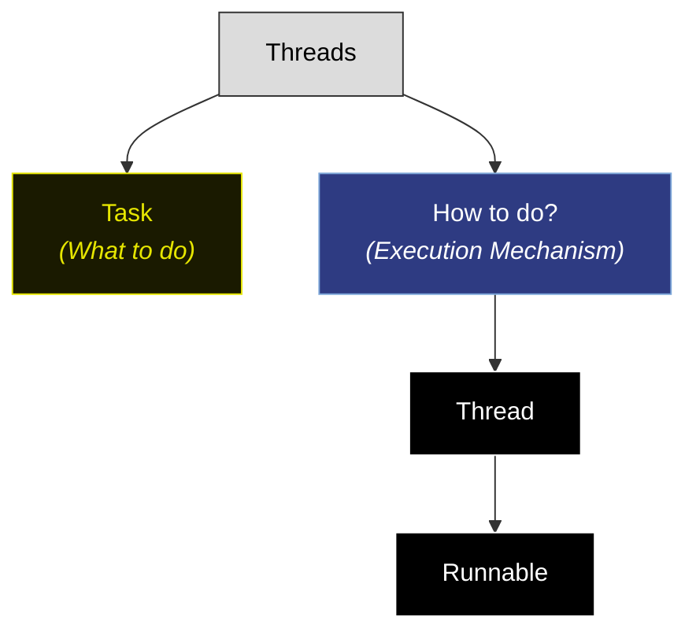
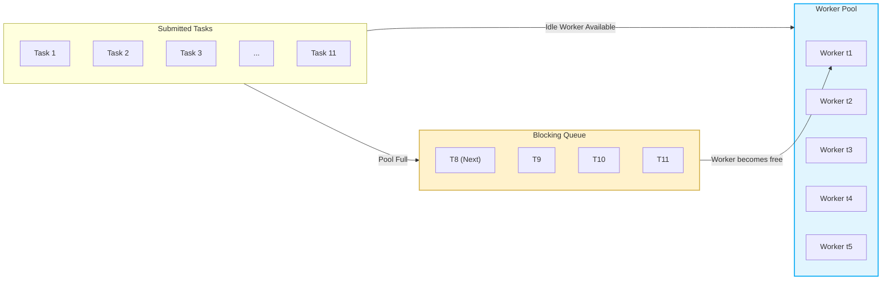

We create thread manually, may lead to complexity.
- memory allocation
```java
Thread t1=new Thread;
t1.start();
```
each thread get `512KB` to `1MB` space.
- OS scheduling => as limited core making many threads will lead to many context switching(waste of time) lead to thrashing(switching)
- Thread creation takes time.
- doing all that to make thread for 1 time use which is waste of resources.
Thus, manual is bad approach. as like hire new chief to make new dish and then fire him.
Thus, to solve it by Executor framework

java will bring a frame work (like collection framework)
it only ask what to do(Task) => no how.
It is done using new concept thread pool
## Thread pool
There are many threads called workers in this pool.
each task is assigned to thread/worker.
This thread/worker in thread pool will not terminate after task it will go to thread pool.
life cycle is managed by thread pool. => thread repeatability.
It has queue => for tasks (if thread no available will send in queue). thus fair.

if queue is full => task will be discard.
There are many types of thread pool.
