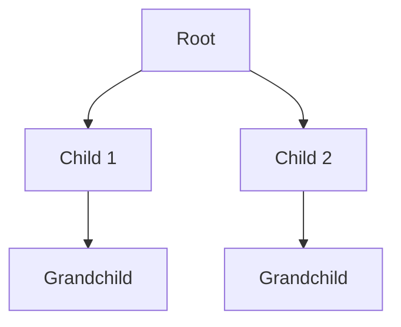
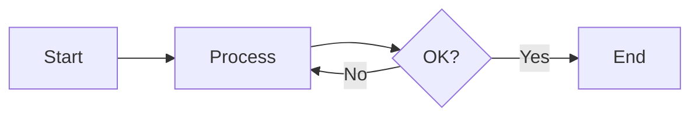

---
tags:
  - cs/data-structures
  - cs/algorithms
type: 
complexity:
  time: 
  space: 
---
# 🌳 {{title}}

## 📝 Description
> Brief explanation of what this data structure/algorithm is and its purpose.

## 📊 Visualization
### Tree/Graph Example (Mermaid)


### Flow/Logic


## 💻 Implementation
### C
```c
// Paste C code here
```

### Python
```python
# Paste Python code here
```

## ⏱️ Complexity Analysis
- **Time Complexity:** 
- **Space Complexity:** 

## 🔗 Resources & Practice
- [LeetCode Link]()
- [GeeksForGeeks]()
- Related Notes: [[ ]]
